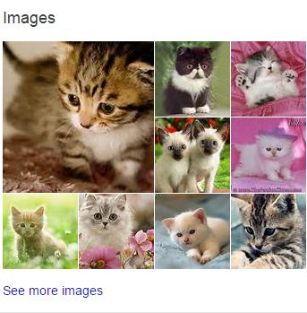
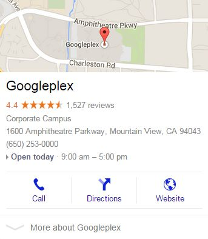

# 訪れるクエリの評価

訪れる意図のクエリの中には、ユーザーの場所が**マサチューセッツ州のボストン**で、クエリが中華　レストランのように、クエリ自体は地域を指定していないが、ユーザーの場所が分かっている場合があり、そのときはユーザーの場所の近くにある検索結果が一番役に立つ。

近いとはどのくらい近いのか、訪問者の結果の距離が遠すぎるかどうかを決定する際には、事業または事業体のタイプを考慮する必要がある。例えば、多く人は遠くのガソリンスタンド、喫茶店、スーパーマーケットへは行かない。これらのタイプのビジネスでは多くのユーザーは近くを期待している。

しかしながら、病院、図書館、限定的なタイプのレストラン、プールなどの公共施設、ハイキングコースのように遠くても行こうと思うユーザーがいるかもしれないビジネスもある。専門病院などの場合、もっと遠い検索結果でも訪問しようと思うユーザーもいるかもしれない。

言い換えると、ユーザーが近くの検索結果を探しているとき、近くが指している距離はクエリによって異なる。いつものように、あなたの判断で使いなさい。

## ユーザー所在地が影響する（しない）例

前述のように、ユーザーの所在地はいつもクエリ・意図の解釈に影響するわけではない。以下の例は、1つ目は所在地が影響する場合、残りの2つは所在地が関係ない例である。

**クエリ：**minimum wage rate  
**ユーザーの所在地：**<!-- -->カンザス州ウィチタ  
**ユーザーの意図：**<!-- -->現在の最低賃金を調べる。アメリカ国内の最低賃金は州によって違う。ユーザーは、自分の状態の最低賃金とそれが他の場所とどのように比較されているかに興味があるかもしれない。

  
  
SCRBでは、一番目立つところに完全で正確な回答を、モバイルユーザーに分かりやすいように表示している。

**注：**<!-- -->この例が書かれた時点で、ユーザーに現在の情報が表示されたとする。この作業を評価した場合は、このSCRBの最低賃金率がカンザス州について正確であることを確認する必要がある。

  
  
カンザス州の最低賃金に関するページである。

  
  
LPではアメリカの全州の最低賃金を掲載している。労働省公式サイトに掲載されており、このトピックについてのE‑A‑Tも高いが、カンザスに関する情報をこの中から見つけ出すのは手間がかかる。

  
  
カリフォルニア州公式サイト内の、カリフォルニア州の最低賃金に関するページである。

**クエリ：**pictures of kittens  
**ユーザーの所在地：**<!-- -->ペンシルバニア州ピッツバーグ  
**ユーザーの意図：**<!-- -->ユーザーは子猫の写真を探している。訪れるがないクエリだ。ピッツバーグにある子猫の写真を見つけようとする明らかなユーザーの意図はない。ユーザーの所在地はNM評価では何役割も果たさない。

  
  
LPは、子猫の写真がいっぱいのページだ。RBには、ユーザーの満足度が高い写真がある。

  
  
これは、ピッツバーグエリアに家を必要とするペットのローカルリストだ。このページにペットの写真は一切なく、個々のリストにも写真がほとんどない。

**クエリ：**google jobs  
**ユーザーの所在地：**<!-- -->フロリダ州マイアミ  
**ユーザーの意図：**<!-- -->ユーザーはGoogleで就職の機会を探している。

  
  
ユーザーはGoogleで仕事を探していますが、この結果のブロックには、ユーザーが仕事の機会を掘り起こすのに役立つ情報はない。

  
  
これはGoogleのキャリアと仕事についての公式ページで、ユーザーは現在開かれている機会を検索できる。このページはユーザーが探していたもので、Fully Meetsになる。

Copyright 2020 © Google (<a href="https://static.googleusercontent.com/media/guidelines.raterhub.com///searchqualityevaluatorguidelines.pdf">source</a>)

