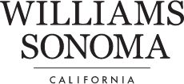

# ページ・Webサイトの理解

PQ評価を行う上で、Webサイトについて深く理解することが必要である。このガイドラインでは、はじめに基本的な事項、流れに沿ってPQ評価の要点を理解していく。「自分はWebに詳しい」と思っている人もこのセクションを一読する。

## 重要な用語の定義

以下に重要な用語をまとめる。

**ページ（Webページ）**
:   wwwに接続していて、Chromeなどのブラウザで「閲覧・訪問」できるもの。1990年代は、ページのコンテンツは主に文章とリンクのみだった。現代ではコンテンツの幅も広がり、動画・画像などの「メディア」をはじめ、商品購入機能、メール、計算機、オンラインゲーム等の「機能」まで広がっている。

**URL**
:   ブラウザがページを表示するのに利用される文字列のこと。PQ評価では「ホストとドメインの違い」等のURL構造についての深い知識は不要である。そうした点に興味がある場合は、[ここを](https://en.wikipedia.org/wiki/URL)参照する。

**Webサイト**
:   ページの集合体であり、多くの場合は各ページ間にはハイパーリンクが存在する。個人・企業・政府・その他組織によって作成され、公開されている。有名なものには、Facebook・Wikipedia・Yahoo・YouTube などがある。

  **注：**<!-- -->このガイドラインでは、「同一の個人・企業が所有し管理するページ群」（例：yahoo.com）をWebサイトとして扱うが、「あるWebサイト内の、独自の目的を持った部門」（例：[Yahoo!ファイナンス](http://finance.yahoo.com/)・[Yahoo!スポーツ](http://sports.yahoo.com/)・[Yahoo!メール](http://mail.yahoo.com/)など）もWebサイトとして扱うこともある。また、Yahoo!ファイナンスやYahoo!スポーツのページをYahoo!に属するページとして扱うこともある。

**ホームページ（トップページ）**
:   Webサイトのメインのページであり、ユーザーがWebサイトを訪問した際にはじめに表示されるページ。Appleなら「[http://www.apple.com](http://www.apple.com)」が、Yahoo!なら「[http://www.yahoo.com](http://www.yahoo.com)」が、Yahoo!ファイナンスなら「[http://finance.yahoo.com](http://finance.yahoo.com)」がホームページである。サブページ内の「フォーム」というリンクやロゴをクリックすることでホームページに行けることが多い。

**サブページ**
:   ホームページ以外をサブページと呼ぶ。例えば、「[http://www.apple.com/iphone](http://www.apple.com/iphone)」・「[http://finance.yahoo.com/options](http://finance.yahoo.com/options)」等はYahoo!ファイナンスのサブページである。

**ウェブマスター**
:   Webサイトを維持・管理する人。

**重要：**<!-- -->評価者はリンクをクリックし、URLの書き換えを行い、Webサイトを簡単に探し回れるようにならなければならない。サイトの探偵・探検家になろう。

## 「ページ目的」とは

ページの作られた意味のことを「ページの目的」という。各ページは１つもしくは複数の目的があって作られるものである。ページの大半はユーザーにとって役立つことを目的に作られるものであるが、ページの中には、「金儲けが目的で役立たないページ」「ユーザーを害する事が目的」といったページも存在する。「ページの目的」を理解することが、ページを理解することの第一歩である。

ページを理解する理由は以下のとおりである。

- 「ページの目的を達成できているか」を判定することがPQ評価の目的である。そのために、ページの目的、場合によってWebサイトの目的も理解する必要がある。
- 評価する時にどんな点が重要か理解するには、ページの目的を理解する必要がある。
- ユーザーのためにWebサイト・ページはあるべきである。「ユーザーに害を与える目的」「騙す目的」「金儲けだけの目的」などのページは、低いPQ評価を受ける。この点は後述する

特定の系統が他の系統より、品質が良いということは絶対にない。例えば、エンサイクロペディア系のページが、常にユーモア系のページより品質がいいとは限らない。

**重要：**<!-- -->ページの系統は、「ショッピング」「ニュース」「フォーラム」「動画」「エラーメッセージ」「PDF」「画像」「ゴシップ」「ユーモア」など様々ある。系統はPQ評価とは無関係である。ページの目的を理解して、評価を行っていく。

ユーザーの役に立つ「ページの目的」を以下にまとめる。

- トピックについての情報を共有する。
- 個人的・社会的情報を共有する。
- 写真・動画等のメディアを共有する。
- 意見・見解を発表する。
- 人を楽しませる。
- 商品・サービスを販売する。
- ユーザーが質問を投稿したり、それに回答できるようにしたりする。
- ユーザーがソフトウェアを共有・ダウンロードできるようにする。

何を目的としたページであるかを簡潔にまとめた例である。

[ニュースサイトのホームページ](https://static.googleusercontent.com/media/www.google.com/en//insidesearch/howsearchworks/assets/GG/PQ.2.1.1.jpg)

**ページ目的：**  
最近の重要なイベントをユーザーに提供する。

[商品販売ページ](https://static.googleusercontent.com/media/www.google.com/en//insidesearch/howsearchworks/assets/GG/PQ.2.1.2.jpg)

**ページ目的：**  
商品情報の掲載、販売。

[動画ページ](https://static.googleusercontent.com/media/www.google.com/en//insidesearch/howsearchworks/assets/GG/PQ.2.1.3.jpg)

**ページ目的：**  
ユーザーに動画を提供する。

[通貨の変換ページ](https://static.googleusercontent.com/media/www.google.com/en//insidesearch/howsearchworks/assets/GG/PQ.2.1.4.jpg)

**ページ目的：**  
異なる通貨を計算する。

[ページの例（OmNomNomNom）](https://static.googleusercontent.com/media/www.google.com/en//insidesearch/howsearchworks/assets/GG/PQ.2.1.7.jpg)：このページも一見、無意味で変わったページに見える。しかし、このページはおもしろさと芸術的表現を共有するための目的があることが分かる。このページ・Webサイトはユーザーに役立つ、善意の目的があるといえる。「[Webサイトについて](https://static.googleusercontent.com/media/www.google.com/en//insidesearch/howsearchworks/assets/GG/OmNomNomNomAbout.jpg)」のページの内容は十分ではないが、「[FAQ](https://static.googleusercontent.com/media/www.google.com/en//insidesearch/howsearchworks/assets/GG/PQ.2.1.8.jpg)」のページからWebサイトについて十分知ることができる。

## YMYLページ（金銭・人生に関するページ）

ユーザーの将来的な幸福・健康・金銭的な安定性に関する可能性ページによってはある。GoogleはこのようなページをYMYL（Your Money or Your Life）ページと呼ぶ。以下その代表例をまとめた。

- 商品の売買・金銭の受け渡し：ショップ・銀行など、オンラインでの購入・送金・支払い機能があるページ（オンラインストアやネットバンキングページ）。
- 財産に関する情報：投資・税・退職金運用・家の購入・学費支払・生命保険などの助言や情報に関するページ。
- 医薬系情報：肉体/精神面の健康・薬品・病気・栄養学などの情報や助言を掲載するページ。
- 法的情報：離婚・養育権・遺言書作成・市民権獲得などの情報や助言を掲載するページ。
- ニュースまたは、市民に知らせる公共/公式のページでの重要な情報：地方/国家の政府が出す人、法律、災害対応サービス、政府プログラム、社会サービス、国際事象、ビジネス、政治、科学、技術などの重要なトピックに関するニュースに関するページ（全てのページがYMYLになるわけではないことに注意する。自分自身の判断と経験で判断する。）。
- その他：養子縁組・車の安全性など、「金銭・生命に重大な影響を与えうる情報」全般。

YMYLページに関して、Googleの評価基準は厳しくなる。品質の悪いYMYLページは、ユーザーの生活である幸福・健康・金銭的な安定性を害する可能性がある。

## ページのコンテンツを理解する

「MC（メインコンテンツ）」「SC（補助的コンテンツ）」「Ads（広告・マネタイズ要素）」にページのコンテンツは分類できる。ページそれぞれのコンテンツがどれに当たるのかを理解することが、ページの目的を理解してPQ評価を行うために必要となってくる。

様々なリンクをクリックすることで、ページが複雑なコンテンツであってもサイト内を探索することができる。「タブ内に隠されたコンテンツ」「ページ内のインタラクティブ要素」なども確認する。また、「タブ内に隠されたコンテンツ」も内容に応じて「MC」「SC」「Ads」の一部とみなす。

### MC（メインコンテンツ）の判別

「ページの目的達成に直接関わる部分」は全てMC（メインコンテンツ）である。ウェブマスターは基本的に全てのMCを直接制御する（ユーザー生成コンテンツ（UGC）は除く）コンテンツの種類についてMCは問わない。「テキスト」「画像」「動画」「計算機・ゲーム等の機能」「ユーザー生成コンテンツ」などもMCになる。タブの中にユーザーレビューの情報やその他「タブ内に隠されたコンテンツ」をMC判定することもあるので注意する。

The MC also includes the title at the top of the page ([example](https://guidelines.raterhub.com/images/2.2.4mc-title.jpg)). Descriptive MC titles allow users to make informed decisions about what pages to visit. Helpful titles summarize the MC on the page.

**ニュースサイトホームページ：**<!-- -->最近の重要なイベントをユーザーに提供する。

[参考画像](https://guidelines.raterhub.com/images/2.2.1m.jpg)  
（黄色で表示）

**ニュース記事ページ：**<!-- -->記事の掲載

[参考画像](https://guidelines.raterhub.com/images/2.4.news.MC.jpg)  
（黄色で表示）

**商品販売ページ：**<!-- -->商品情報の掲載・販売・タブ内に隠された「レビュー」「配送について」「安全性について」などもMC考慮対象になるので注意。

[参考画像](https://guidelines.raterhub.com/images/2.2.4mc.jpg)  
（黄色で表示）

**動画ページ：**<!-- -->ユーザーに動画を提供する。

[参考画像](https://guidelines.raterhub.com/images/EngineerGuideCatsMC.jpg)  
（黄色で表示）

**通貨変換ページ：**<!-- -->異なる通貨の計算をする。

[参考画像](https://guidelines.raterhub.com/images/PQ.2.2.6m.jpg)  
（黄色で表示）

**ブログの投稿記事ページ：**<!-- -->投稿を見せる。

[参考画像](https://guidelines.raterhub.com/images/PQ.2.2.9m.jpg)  
（黄色で表示）

**検索エンジンページ：**<!-- -->ユーザーがクエリを入力し、検索できるようする。

[参考画像](https://guidelines.raterhub.com/images/PQ.2.2.7m.jpg)  
（黄色で表示）

**銀行のログインページ：**<!-- -->オンラインバンクの利用許可をする。

[参考画像](https://guidelines.raterhub.com/images/PQ.2.2.8m.jpg)  
（黄色で表示）

### SC（補助的コンテンツ）の判別

SCはUX（UX）を向上させるコンテンツを言い、ページの目的達成に直接は関与しないコンテンツのこと。UXを決定する重要な要素であるUXを制御するのはウェブマスターである。一般的なタイプのSCの一例としては、ユーザーがウェブサイトの他の部分を訪問することを可能にするナビゲーションリンクである。「隠されたコンテンツ」がSCになることもあるので注意する。

「MC/Adsではない」部分を探せば、SCを簡単に判別できる。

**ニュース記事ページ：**<!-- -->記事の掲載

[参考画像](https://guidelines.raterhub.com/images/2.4.news.SC.jpg)  
（青色で表示）

**商品販売ページ：**<!-- -->商品情報の掲載・販売

[参考画像](https://guidelines.raterhub.com/images/PQ.2.2.4s.jpg)  
（青色で表示）

**動画ページ：**<!-- -->ユーザーに動画を提供する。

[参考画像](https://guidelines.raterhub.com/images/EngineerGuideCatsSC.jpg)  
（青色で表示）

**ブログの投稿記事ページ：**<!-- -->投稿を見せる。

[参考画像](https://guidelines.raterhub.com/images/PQ.2.2.9s.jpg)  
（青色で表示）

### Ads（広告・マネタイズ要素）の班別

UXの向上にAdsは役立つ可能性がある。広告・マネタイズ要素（Ads）のコンテンツやリンクはページの収益を上げるもの。Adsの有無は評価には影響しない。品質の良いコンテンツを作成することや、質の良いコンテンツを維持することは費用がかかるため、広告で収益がなければ、Webページが存在しない可能性がある。

広告やアフィリエイトプログラムなど、ウェブページから収益を得る方法はいくつかある。ウェブサイト収益化の詳細については、[ここ](http://en.wikipedia.org/wiki/Website_monetization)を見る。モバイルページの収益受け取りは、デスクトップページの収益受け取りよりも慎重に行う必要がある。

最も一般的な収益を得る方法は広告である。広告は「広告」「スポンサードリンク」「スポンサードリスティング」「スポンサード結果」などのラベルがついていることがある。通常は、コンテンツ上のリンクをクリックして、 そのウェブサイト外のURLに転送する。ページをリロードすると広告が変わる可能性があり、異なるページに異なる広告が表示されることがある。

ウェブマスターは、（[広告ネットワーク](http://en.wikipedia.org/wiki/Advertising_network)に参加するなどして）自分のページに広告を表示することを選択できるが、広告の内容を直接制御できるとは限らない。Googleはページ上に表示される広告全ては、ウェブマスターがその責任を負うとする。

**重要：**<!-- -->Google はあらゆる有償のリンクをAdsとみなす。収益化の類型については[ここ](http://en.wikipedia.org/wiki/Website_monetization)を参照する。

**ニュース記事ページ：**<!-- -->記事の掲載

[参考画像](https://guidelines.raterhub.com/images/2.4.news.Ads.jpg)  
（赤色で表示）

**商品販売ページ：**<!-- -->商品情報の掲載・販売

[参考画像](https://guidelines.raterhub.com/images/EngineerGuideCatsAd.jpg)  
（赤色で表示）

**動画ページ：**<!-- -->ユーザーに動画を提供する。

[参考画像](https://guidelines.raterhub.com/images/PQ.2.2.9a.jpg)  
（赤色で表示）

**ブログの投稿記事ページ：**<!-- -->投稿を見せる。

[参考画像](https://guidelines.raterhub.com/images/2.2.4-Ads.jpg)  
（赤色で表示）

### MC/SC/Adsまとめ

以下にまとめを記す。

- **MC (主要となるコンテンツ)**  
ページの目的を達成するために直接役立つページの一部である。MCはページが存在する理由。MCの品質は、ウェブページのPage Quality評価において非常に大きな役割を果たす。
- **SC (補足コンテンツ)**  
重要な一部分である。ページの目的をより良く達成するのに役立つ。また、その逆の全体的な経験を損なう可能性がある。
- **Ads (広告・収益化)**  
多くのページに広告/収益化（広告）が存在する。広告や収益化がなければ、Webサイトを維持して質の高いコンテンツを作成するための費用がかかるため、ウェブページが存在できなくなる可能性がある。広告の有無は、高品質または低品質の評価に影響はない。

一部のページでは、レビューはMCにみなされることもある。自分自身でページの目的を判断する必要がある。

すべてを細かく分類する必要はなく、MCとAdsを判断できれば、残りは全てSCと分類することができる。

**ニュース記事ページ：**<!-- -->記事の掲載

[参考画像](https://guidelines.raterhub.com/images/2.4.news.All.jpg)  
（MC・SC・Ads）

**商品販売ページ：**<!-- -->商品情報の掲載・販売

[参考画像](https://guidelines.raterhub.com/images/PQ.2.2.4all.jpg)  
（MC・SC・Ads）

**動画ページ：**<!-- -->ユーザーに動画を提供する。

[参考画像](https://guidelines.raterhub.com/images/EngineerGuideCatsAll.jpg)  
（MC・SC・Ads）

**通貨変換ページ：**<!-- -->異なる通貨の計算をする。

[参考画像](https://guidelines.raterhub.com/images/PQ.2.2.9all.jpg)  
（MC・SC・Ads）

**ブログの投稿記事ページ：**<!-- -->投稿を見せる。

[参考画像](https://guidelines.raterhub.com/images/PQ.2.2.6all.jpg)  
（MC・SC・Ads）

**銀行のログインページ：**<!-- -->オンラインバンクの利用許可をする。

[参考画像](https://guidelines.raterhub.com/images/PQ.2.2.8all.jpg)  
（MC・SC・Ads）

## Webサイトの理解

Webサイトの一部としてページを見ることでより深く意味を理解できる。PQ評価の基準の一部は、ページが属するウェブサイトに基づいている。

ウェブサイトを理解するには、ウェブサイト自体のウェブサイトに関する情報を探す。Webサイトは普通、自身のサイトについてすべてを伝えることを非常に熱望している。

また、Webサイト自体の評価を知ることも必要である。外部のサイトからの情報を知る必要があり、Webサイト自身が伝えていることと、外部の独立したサイトがしている評価とに相違がある場合、Googleは独立したサイトの情報を信頼する。

### ホームページ（トップページ）の見つけ方

Webサイトのホームページには、普通サイト内の重要ページへ移動するのリンクがある。ウェブマスターもホームページから他のページにアクセスを容易にするように多くの場合している。

ホームページの探し方

- PQ評価作業でURLのLPを調べる。
- 「ホーム」「メインページ」と表示されたリンクを探す。
- <kbd>Ctrl</kbd>+<kbd>F</kbd>（Macの場合は<kbd>⌘</kbd>+<kbd>F</kbd>等のページ検索で「ホーム」「メイン」を検索する。または、Webサイトのロゴをクリックしてみる。

場合によって、ナビゲーションリンクもホームページリンクもなく、ホームページを見つけるためのロゴなどの手段もないウェブページやウェブサイトが表示されることがある。High ・Highestの評価を受けるサイトであってもホームページへの誘導のないサイトもある。そのような時は、「.com」「.org」「.net」「.info」などの右側にあるものすべてを削除してURLを変更し、ページを更新する。

複数のホームページ候補が存在する場合がある。
例えば、[http://finance.yahoo.com/news/category-stocks](http://finance.yahoo.com/news/category-stocks)の場合、[http://finance.yahoo.com](http://finance.yahoo.com)または[http://www.yahoo.com](http://www.yahoo.com)のホームページ候補があり迷うこともある。

**重要：**<!-- -->複数のホームページ候補がある場合は、情報量を多く提供しているものを自身で判断する。目的はWebページを理解することであり、ホームページを特定することではない。

評価対象のページURL、ホームページのURL、ホームページへの誘導の画像を以下に記載している。画像上のリンクからはホームページへの導線が赤色のボックスで表示してある。

**評価対象のページURL：**  
[http://www.williams-sonoma.com<wbr>/products/shun-premier-7-<wbr>piece-knife-block-set](http://www.williams-sonoma.com/products/shun-premier-7-piece-knife-block-set)

**ホームページのURL：**  
[http://www.williams-sonoma.com](http://www.williams-sonoma.com)

**ホームページへの誘導の画像：**  
[Williams-Sonoma Homepage](http://www.williams-sonoma.com)  
  
LP左上のロゴをクリックすると、ホームページに遷移

**評価対象のページURL：**  
[http://answers.yahoo.com<wbr>/question/index;_ylt=<wbr>AnAYEU1fED6ncg1jRCFy30kk5XNG;<wbr>_ylv=3?qid=20091214193523AAQqHQS](http://answers.yahoo.com/question/index;_ylt=AnAYEU1fED6ncg1jRCFy30kk5XNG;_ylv=3?qid=20091214193523AAQqHQS)

**ホームページのURL：**  
[http://answers.yahoo.com](http://answers.yahoo.com)

この場合のホームページは[http://answers.yahoo.com](http://answers.yahoo.com)を選択する。[http://www.yahoo.com](http://www.yahoo.com)ではない。理由として、ロゴからは[http://answers.yahoo.com](http://answers.yahoo.com)へ転送される。Yahoo!Answerに関する情報量は[http://answers.yahoo.com](http://answers.yahoo.com)に多いため。

**ホームページへの誘導の画像：**  
[Specific Yahoo Answers Page](https://guidelines.raterhub.com/images/PQexamples.3.1.5.jpg)  
  
LP左上のロゴをクリックすると、ホームページに遷移

**評価対象のページURL：**  
[http://hms.harvard.edu/about-hms/facts-figures](http://hms.harvard.edu/about-hms/facts-figures)

[http://hms.harvard.edu](http://hms.harvard.edu)
**ホームページのURL：**  

この場合ホームページは[http://hms.harvard.edu](http://hms.harvard.edu)を選択する。[http://www.harvard.edu](http://www.harvard.edu)ではない。理由として、ロゴからは[http://hms.harvard.edu](http://hms.harvard.edu)に転送される。

**ホームページへの誘導の画像：**  
[Harvard Medical School Facts and Figures Page](https://guidelines.raterhub.com/images/HMS.jpg)  
  
LP左上のロゴをクリックすると、ホームページに遷移

### 「Webサイトの責任者」と「コンテンツ作成者」の見つけ方

ページは全てWebサイトに所属していて、かつ以下のものが明確でなければならない

- 誰（個人、会社、ビジネス、財団など）がWebサイトを担当しているのか
- 誰（個人、会社、ビジネス、財団など）が評価対象のページの作成者なのか

Webサイトは普通、ページ上のコンテンツ作成者を明確にしている。それには理由がある。

- 商用ウェブサイトには、保護したい著作物があるため
- 自社がコンテンツを作成したとユーザーに知ってもらうため
- アーティスト、作家、ミュージシャン、その他のオリジナルのコンテンツ制作者は、通常、知られて評価されたいため
- 財団は支援やボランティアを必要とするため
- 高品質の店舗では、ユーザーがオンラインで安心して購入できるようにするため

ほとんどのWebサイトには、サイトの所有者に関する情報を提供する「お問い合わせ」または「当サイトについて」などのページがある。そして、多くの企業には、会社概要、業務内容、求人情報などのWebサイトやブログがある。GoogleとMarriottの両方がこれの例であり、他にも多くの例がある。

- [Google 公式ブログ](http://blog.google/)
- [Marriotのブログ](http://www.blogs.marriott.com/)
- [Southwest Airlinesのブログ](http://www.southwestaircommunity.com/)
- [Netflixのブログ](http://techblog.netflix.com/)

多くの場合、ウェブサイトのコンテンツの責任は個人の個人ではなくビジネスや組織が負う。IBM社は、ibm.comのコンテンツの責任を負う。Cleveland Clinicはclevelandclinic.orgのコンテンツを担当しているが、 多くの個人がコンテンツの作成と保守に貢献したとしても、個人はこれらのウェブサイトのコンテンツに責任を負わない。このような場合、Googleは企業または組織を、コンテンツとウェブサイトの管理の責任を負うとみなす。

一部のWebサイトでは、企業や組織がWebサイトを管理して、多数のユーザーがページのMCを作成していることもある。例えば、FacebookはFacebookのWebサイトを管理しているが、コンテンツを作成はユーザーがFacebookページに行う。WikipediaはWikipediaの財団がWebサイトを管理しているが、記事のコンテンツはそれぞれユーザーが作成している。ユーザーが作成したコンテンツを含む他のWebサイトには、YouTube、TwitterなどのソーシャルネットワーキングWebサイト、記事を公開するWebサイト、Q＆Aサイト、フォーラムなどがある。これらのWebサイトについては、各ページを見て、 そのページのコンテンツの作成者を判断する必要がある。

最後に、ライセンスまたはシンジケートにより同一のコンテンツを複数のWebサイトで表示することがある。これは、Webサイトがコンテンツの作成者にお金を払っていること、ビジネス関係があることを意味する。このような場合、コンテンツがWebサイトで作成されていなくても、ライセンスまたはシンジケートされたコンテンツの責任はWebサイト自体にあると見なされる。

### 「当サイトについて」「連絡先」「お客様サービス」などの見つけ方

多くのWebサイトは、ユーザーとのコミュニケーションを取りたいと考えている。ページの不具合などの報告から、コンテンツの削除を求めるまで、ユーザーがWebサイトに連絡する理由はたくさんある。多くのWebサイトでは、連絡するための複数の方法（電子メールアドレス、電話番号、物理アドレス、Web連絡フォームなど）を提供している。

必要な連絡先情報の種類と量は、Webサイトの種類によって異なる。店舗、銀行、クレジットカード会社など、お金を扱うWebサイトでは、連絡先情報と顧客サービス情報が非常に重要である。ユーザーは、問題が発生したときに質問をする、ヘルプを得る手段が必要である。

ショッピングサイトでは「お支払い」「交換」「返品」に関する店舗のポリシーなどと連絡先情報の確認を行う。また、この情報は「お客様サービス」の中にある。

種類によってのWebサイトには、連絡先情報が少なくて良い場合もある。例えば、ユーモアに部類されるWebサイトには、オンラインバンキングのWebサイトのような詳細な連絡先情報のレベルは必要ない。

場合によっては、匿名であることに正当な理由があるWebサイトもあります。例えば、個人のWebサイトには、個人の自宅の住所や電話番号などの個人連絡先情報がないこともある。同様に、ユーザー生成コンテンツを有するWebサイトでは、作成者は偽名またはユーザー名の登録で作成できる。

Webサイトの連絡先またはお客様サービス情報を検索するには、ホームページから始める。「お問い合わせ」または「お客様サービス」のリンクを探す。「お問い合わせ」ページが見つからない場合は、Webサイト内も探してみる。場合によっては、「企業サイト」のリンクや会社のFacebookページで連絡先情報を見つけることもできる。探偵になったつもりで探してみる。

記載するべき情報は、国や地域によって異なるためその点にも注意する。

## Webサイトの評判

Webサイトの評判は、実際のユーザーの経験だけでなく、Webサイトのトピックの専門家である人々の意見に基づいている。Webサイトは、実際の企業、組織などを代表していることが多いことに注意する。したがって、評判調査は、Webサイトと、Webサイトが代表している実際の会社、組織などについても調査する必要がある。

Webサイトの評判は、Webサイトが何で最も知られているかを理解することで、結果として目的がどれほどうまく達成されるかを理解するのにも役立つ。例えば、高品質で独立した調査報告で新聞が知られている一方で、風刺Webサイトがユーモアとして知られている可能性もある。

多くのWebサイトは、ユーザーに自分自身の価値の発信を活発にしている。一部のウェブマスターはこれらの評価ガイドラインを読んで、さまざまなレビューWebサイトに「レビュー」を書いている。しかし、PQ評価では、Webサイトに関する外部の独立した評判情報も検索する必要がある。Webサイトがそれ自体についての1つのことを言うが、その他の評判の良い外部の情報ではWebサイトの記載に同意しない場合、外部の情報源を信頼する。

評価者としての仕事は、Webサイトの1ページまたは2ページの情報を盲目的にただ受け入れるだけでなく、サイトのPage Qualityを真に評価することである。Webサイトが作る主張を懐疑する視点をもつ。

### Webサイトの評判調査

評判調査を使用して、実際のユーザーと専門家がWebサイトについてどのように考えるかを確認する。専門家、ニュース記事、およびWebサイトに関する個人によって作成されたもの、その他の信頼できる情報によるレビュー、参考資料、推奨事項を探していく。

店舗には頻繁にユーザー評価をつけるため、実際に店舗で買い物をしているユーザーの評価に基づいて店舗の評判を理解していく。Googleは、多数の肯定的なユーザー評価を肯定的な評判の証拠とみなす。

他の種類のWebサイトにも様々な評判の形がある。例えば、新聞のWebサイトがジャーナリズム賞を受賞していることがある。ピューリッツァー賞など有名な賞は肯定的な評価に大きく影響する。

高いレベルの権威性や専門知識が必要な場合、Webサイトの評判は、専門家の意見によって判断する必要がある。専門家から評価されることは、非常に肯定的な評判に大きく影響する。

Webサイト全部で評判調査が必要である。あなたが個人的に使っているWebサイトが良い評判を取っているということに限らず、研究していく必要がある。驚く内容が隠されているかもしれない。

### 評判調査の情報源

統計や機械でコンパイルされた情報ではなく、人によって書かれた情報を探していく。ニュース記事、Wikipediaの記事、ブログの記事、雑誌の記事、フォーラムの議論、独立した組織からの評価は、すべて評判情報源になる可能性がある。独立した信頼できる情報源を探していく。

場合によっては、評判に関係しないWebサイトに関する情報を見つけることもある。例えば、[Alexa](http://www.alexa.com/)のようなページには、Webサイトへのインターネットトラフィックに関する情報があるが、肯定的または否定的な評判の判断にはならない。この情報はページPQ評価には役立たないため、無視していく。

### 店舗・ビジネスのレビュー

Customer reviews can be helpful for assessing the reputation of a store or business. However, you should interpret these reviews with care, particularly if there are only a few. Be skeptical of both positive and negative user reviews. Anyone can write them, including the creator of the website or someone the store or business hires for this purpose. See [here](https://guidelines.raterhub.com/images/FerretingOutFakeReviewsOnline.jpg) for a New York Times article on fake reviews and [here](http://www.theguardian.com/money/2013/jan/26/fake-reviews-plague-consumer-websites) for a Guardian article on fake reviews.

顧客のレビューを調査するときは、可能な限り多くを見ていく。どの店舗やWebサイトでも、いくつかの否定的レビューを得ることがある。大規模な店舗や企業には何千ものレビューがあり、ほとんどの場合、いくつかの否定的なレビューが存在する。

レビューの内容は数字だけでなく内容重要であるため、レビューを読むことが大切である。詐欺や財産的な不正行為の信憑性があり説得力のある報告は、極めて否定的な評判の証拠である。否定的なレビューでも1件あったとしても、否定的な評判の証拠にはならない。自分自身で判断していく必要がある。

### 評判の探し方

以下の方法で評判を探していく。

1. ウェブサイトの「ホームページ」を特定する。
例えば、IBMのWebサイトの場合、ibm.comはホームページである。

2. 例としてibm.comを使用して、Googleで次の検索の1つ以上を試してみる。
    - ibm -site:ibm.com: ibm.com以外でのIBMに関する情報を検索
    - "ibm.com" -site:ibm.com: ibm.com以外でのibm.comに関する情報を検索
    - ibm reviews -site:ibm.com: ibm.com以外でのIBMに関するレビューを検索
    - "ibm.com" reviews -site:ibm.com: ibm.com以外でのibm.comに関するレビューを検索

    
<b>注：</b>評判の情報を検索するときは、Webサイトまたは会社自身が作成または作成していないソースで探してみる。例えば、IBMは会社の評判情報の独立した情報源とはみなされない。密接に維持されている公式のFacebookやTwitterのページを持っているかもしれない。独立した情報源の特定と利用に関するWikipediaの記事は<a href="https://en.wikipedia.org/wiki/Wikipedia:Identifying_and_using_independent_sources">ここ</a>を見る。

3. Webサイトについて書いた記事、レビュー、フォーラム投稿、ディスカッションなどを探す。企業にとっては、評判情報やレビューには多くの情報源がある。いくつかの例を出すと：[Yelp](https://guidelines.raterhub.com/images/PQ.ReputationResearchExampleWebsite1.jpg)、[Better Business Bureau](https://guidelines.raterhub.com/images/PQ.ReputationResearchExampleWebsite3.jpg)（ビジネスとチャリティーの信頼性に重点を置く非営利組織）、[Amazon](https://guidelines.raterhub.com/images/PQ.ReputationResearchExample4.jpg)、[Googleショッピング](https://guidelines.raterhub.com/images/PQ.ReputationResearchExample5.jpg)は 特定のサイトを検索してレビューを探すことができる。例えば、ibm site:bbb.orgまたは"ibm.com" site:bbb.orgを試すことができる。

    For content creators, look for biographical data and other sources that are not written by the individual.

    
<b>注：</b>Better Business Bureau（BBB）のWebサイトには高い評価が表示されることがある。ビジネスにはデータが少ないからである。ビジネスが肯定的な評判を持っていることにはならない。しかし、BBBの格付けが非常に低いのは、通常、複数の未解決の苦情の結果である。BBBサイトの非常に低い評価であった否定的な評判の証拠として扱っていく。

4. 有名なニュースサイト、Wikipedia記事またはニュース記事を探す。Wikipediaは、企業や組織を知る良い情報源となる。ibm site:en.wikipedia.orgまたは"ibm.com" site:en.wikipedia.orgを試してみる。賞やその他の認定書や論争や問題など、評判に関する情報も含まれている。一部のWikipediaの記事には、コンテンツの一部に意見の不一致がある、またはコンテンツが古くなっている可能性があることを警告するメッセージが表示される。これについては追加の調査が必要であることを示唆している可能性がある。

以下に評判に関する例をまとめた。

サイト|サイトの評判|説明

**サイト：**  
[信用情報紹介サイト](https://guidelines.raterhub.com/images/PQ_AnnualCreditReport.jpg)

**サイトの評判：**  
[site:検索結果 annualcreditreport.com ‑site:annualcreditreport.com](https://guidelines.raterhub.com/images/SearchResultsForannualcreditreport.comminussiteannualcreditreport.com.jpg)  
[Wikipedia記事](https://guidelines.raterhub.com/images/PQ_AnnualCreditReport_Wikipedia.jpg)  
[著名ニュースサイト関連記事](https://guidelines.raterhub.com/images/PQ_annualcreditreport_WSJ.jpg)

**説明：**  
**良い評判：**<!-- -->米国のユーザーは、社会保険番号を提供され、Webサイトで無料の信用報告書を入手することができる。Wikipediaの記事では、「同サイトは、無料で信用情報を取得できる、国家後任の唯一の情報源である」と述べている。

**注：**<!-- -->ほぼすべてのウェブサイトには顧客サービスに関する苦情があるので、評判調査のさまざまな情報源やレビューを見ていくのが重要である。

**サイト：**  
[病院のサイト](https://guidelines.raterhub.com/images/PQ_Cleveland_Clinic.jpg)

**サイトの評判：**  
[site:検索結果 clevelandclinic.org](https://guidelines.raterhub.com/images/SearchResultsforclevelandclinic.org.jpg)  
[Wikipedia記事](https://guidelines.raterhub.com/images/PQ_ClevelandClinic_Wikipedia.jpg)  
[メディア記事](https://guidelines.raterhub.com/images/PQ_ClevelandClinic_USNews.jpg)

**説明：**  
**良い評判：**<!-- -->Wikipediaによると、このWebサイトを運営する病院はUS News＆World Reportにより「米国の4大病院の1つ」と評価されている。US News＆World Reportの記事にも米国最良の病院と記載がある。ユーザーはこのWebサイト上の医薬情報を信頼できる。

**サイト：**  
[新聞社のサイト](https://guidelines.raterhub.com/images/PQ.3.5.8.jpg)

**サイトの評判：**  
[site:検索結果 csmonitor.com ‑site:csmonitor.com](https://guidelines.raterhub.com/images/PQ.3.5.8.ReputationResearchQuery1.jpg)  
[Wikipedia記事](https://guidelines.raterhub.com/images/RG3.3.5.8.1.jpg)

**説明：**  
**良い評判：**<!-- -->The Christian Science Monitorの新聞についてのWikipedia記事のハイライト部分に注目すると、新聞がピューリッツァー賞の7つの賞を受賞したことを示している。この情報から、csmonitor.comのウェブサイトは肯定的な評価を得ていると考えられる。

**サイト：**  
[Linuxのレポジトリサイト](https://guidelines.raterhub.com/images/kerneldotorg.jpg)

**サイトの評判：**  
[site:検索結果 kernel.org ‑site:kernel.org](https://guidelines.raterhub.com/images/PQ_Examples_site-kernel.org_Google_Search.jpg)  
[Wikipedia article about kernel.org](https://guidelines.raterhub.com/images/kernel.org_wikipedia.jpg)

**説明：**  
**良い評判：**<!-- -->Wikipediaの記事では、「Kernel.orgはLinuxカーネルのソースコードの、メインレポジトリである。同Webサイトからは全バージョンのソースコードをダウンロード可能で、Google、Androidなどの多くのプロジェクトもホストしている。Webサイトの目的はLinuxカーネルの開発者・維持者のためにレポジトリをホスティングする事である。」

**サイト：**  
[通販サイト①](https://guidelines.raterhub.com/images/domeclimber.com.jpg)

**サイトの評判：**  
[評判の検索結果](https://guidelines.raterhub.com/images/searchreusltsfordomeclimber.com_site_bbb.org.jpg)  
[レビューの検索結果](https://guidelines.raterhub.com/images/SearchResultsDomeClimber.comReviews.jpg)  
[BBBでの評判](https://guidelines.raterhub.com/images/DomeClimberBBBReview.jpg)  
[TrustLinkでの悪評](https://guidelines.raterhub.com/images/TrustLinkDomeClimberNegativeReviews.jpg)  
[否定的なレビュー](https://guidelines.raterhub.com/images/DupedByDomeClimberArticle.jpg)

**説明：**  
**極めて悪い評判：**<!-- -->このビジネスのBBBレーティングはFである。（つまり、BBBが指定する最低レーティング）。また、金融詐欺に関するニュース記事がある。ユーザーがお金を送っていても、何も受け取っていないと言われる。告発のWebサイトやレビューが存在する。

**サイト：**  
[通販サイト②](https://guidelines.raterhub.com/images/RG3_3.5-40.jpg)

**サイトの評判：**  
[評判の検索結果](https://guidelines.raterhub.com/images/SearchResultsfordecormyeyes.comminussitedecormyeyes.com.jpg)  
[BBBのページ](https://guidelines.raterhub.com/images/PQ.3.5.5.jpg)  
[Wikipedia記事](https://guidelines.raterhub.com/images/PQ_DecorMyEyes_Wikipedia.jpg)  
[ニューヨークタイムズ記事](https://guidelines.raterhub.com/images/PQ_decormyeyes_NYTimes.jpg)

**説明：**  
**極めて悪い評判：**<!-- -->このWebサイトは、身体を脅かすような犯罪行為を行っている。

**サイト：**  
[傷痍軍人の支援機関](https://guidelines.raterhub.com/images/PQ.3.5.10.jpg)

**サイトの評判：**  
[評判の検索結果](https://guidelines.raterhub.com/images/PQ.3.5.10.ReputationResearchQuery2.jpg)  
[否定的なレビュー①](https://guidelines.raterhub.com/images/PQ.3.5.10.ReputationInformation1.jpg)  
[否定的なレビュー②](https://guidelines.raterhub.com/images/PQ.3.5.10.ReputationInformation2.jpg)  
[否定的なレビュー③](https://guidelines.raterhub.com/images/PQ.3.5.10.ReputationInformation3.jpg)  
[否定的なレビュー④](https://guidelines.raterhub.com/images/PQ.3.5.10.ReputationInformation4.jpg)

**説明：**  
**極めて悪い評判：**<!-- -->ニュースサイトや慈善団体のウォッチドッグサイトには、詐欺や財務上の誤った取り扱いをしているという記述が多く。否定的な記事が多くあがっている。

### 評判が見つからなかった場合の対処法

大企業の情報や大きな規模のWebサイトの情報は評判情報を期待できる。

小規模な組織のWebサイトの評判についての情報は、ほとんど見つからない。これは肯定的または否定的な評判を示すものではない。多くの小規模な地方の企業やコミュニティ組織は、小規模な「Webの存在」のため、Web上のレビューではなく、口コミに依存している。これらの小規模な企業や組織にとって、評判がないということはPage Qualityの低下を示すものではない。
