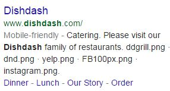

# Reporting Duplicate Results in Tasks

In some rating tasks, you may be asked to determine whether any results are Duplicates (dupes). This section provides guidance and examples of how to report duplicate results In Needs Met (NM) rating tasks.

## Pre-Identified Duplicates

Some duplicate results are automatically detected and will be pre-identified for you. They will be annotated by the text
"**Same as**..." right below the slider and above the result block.

This is what these pre-identified dupes look like:

Left Side|Right Side
---|---
|

**Please note:** You cannot unselect dupes that have been automatically detected and pre-identified.

## Rater-Identified Duplicates

You are also asked to help identify duplicate results that have not been automatically detected. Please mark two results as dupes if they have essentially the same content on the main landing page AND you would not want a search engine to return both results for the query.

Please note that in Needs Met rating and other query-based tasks, dupe identification is **query-dependent**.

- **Specific queries:** For queries where the user is looking for a specific piece of content (such as queries looking for song lyrics, queries looking for a specific article, etc.), obtaining that piece of content from **different sites** could be helpful for users to verify the information, so they should not be rated as dupes.

- **Broad queries:** If the query is broad, then returning the same piece of content is not what the user is looking for, and hence those results **should** be flagged as dupes. Results may be considered dupes even if they have minor content differences on the page (such as different ads, images, or related links).

Please identify dupes both within the same side and across sides. Even for cross-side results, you should still ask yourself the question, "Would users want to see both results if they were returned by the same search engine?"

**Note:** If two result blocks have very different types of content or very different appearances, do not mark them as duplicates even if they have the same landing page URL. For example, these two blocks should not be marked as duplicates of each other.

|||
-|-
|

## Reporting Duplicate Results

When you notice that the results in two or more result blocks are duplicates, please click on the **Select Dupe** link at the top of one of the results. The current result (the result you clicked on) will be highlighted in red at the top of the block.

You can then check results that are duplicates of the current result, and the checked results will be highlighted in yellow. You must select the "**Dupe of**..." button.

The duplicate results that you checked will be annotated by "**Dupe of**..." text at the top of the block. After selecting all dupes, click on the **finish selecting dupes** link to return to the normal rating mode. The link's name will change back to **Select Dupes**, and you will be able to report other sets of dupes, if there are any. If you change your mind, you can always uncheck a result.

**Dupes**

QUERY: `choosing and installing a motorcycle battery`

URL 1: [http://www.caimag.com/wordpress/2010/03/06/motorcycle-battery-how-to-choose-install](http://www.caimag.com/wordpress/2010/03/06/motorcycle-battery-how-to-choose-install)

URL 2: [http://www.articlesbase.com/motorcycles-articles/choosing-and-installing-a-motorcycle-battery-47798.html](http://www.articlesbase.com/motorcycles-articles/choosing-and-installing-a-motorcycle-battery-47798.html)

**Reason:** Both of these results display the same article (which also appears on many other pages on the web). The only real difference between the landing pages are the Ads displayed around the article. The query is broad enough that users would **not** benefit by search engines returning more than one of these results.

**Dupes**

QUERY: `jason castro`

URL 1: [http://www.myspace.com/jasoncastromusic](http://www.myspace.com/jasoncastromusic)

URL 2: [http://www.myspace.com/jasoncastromusic?MyToken=503599bf-01cf-4427-bdf4-d63920c107f9](http://www.myspace.com/jasoncastromusic?MyToken=503599bf-01cf-4427-bdf4-d63920c107f9)

**Reason:** These two results have the same landing page, even though the URLs are different. Users would **not** benefit by search engines returning both results.

**Not Dupes**

QUERY: `material girl lyrics`

URL 1: [http://www.lyricsfreak.com/m/madonna/material+girl_20086925.html](http://www.lyricsfreak.com/m/madonna/material+girl_20086925.html)

URL 2: [http://www.lyrics007.com/Madonna%20Lyrics/Material%20Girl%20Lyrics.html](http://www.lyrics007.com/Madonna%20Lyrics/Material%20Girl%20Lyrics.html)

**Reason:** Even though both pages display the lyrics to the song "Material Girl," users would probably want to have the option to visit both pages so that they could verify the accuracy of the lyrics. Users could benefit by search engines returning more than one page with the lyrics to the song.
