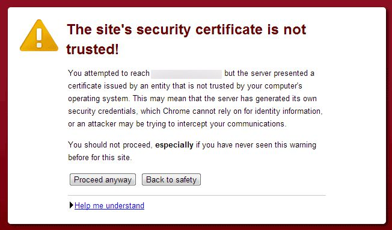
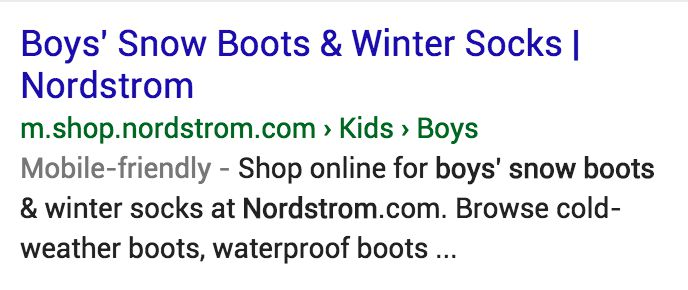
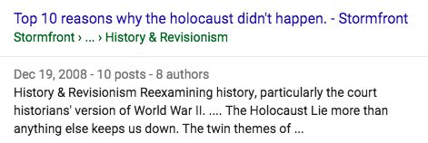

# Rating Porn, Foreign Language, Did Not Load, and Upsetting‑Offensive Results

You will assign **Porn**, **Foreign Language**, **Did Not Load**, and **Upsetting‑Offensive** flags to result blocks when appropriate. Some rating tasks may ask you to identify **Not‑for‑Everyone** results. All flags are query-independent, meaning that they do not depend on the query. Here is a screenshot of the flags:

Click on the flag name to select it. The flag block will turn red and change the "No" to "Yes." For example, here is a result that shows when the **Porn** flag should be used.

Query and User Intent|Result Block, Flag, Needs Met Rating|Explanation
---|---|---
**Query:** `freeones`, English (US)  **User Location:** Mountain View, California  **User Intent:** Go to the Freeones website.|  |This LP is the homepage of the Freeones website, a porn site.  This result merits a FullyM rating and the Porn flag.

## Porn Flag

Please assign the **Porn** flag to all porn pages, whether the query is porn‑seeking or not. The **Porn** flag does not depend on the query or user intent.

This flag should be used if the content inside the result block, or the content on the LP, is pornographic, including porn images, links, text, pop-ups, and/or prominent porn ads. An image may be considered porn in one culture or country, but not another. Please use your judgment and knowledge of your locale.

**Remember:** The **Porn** flag is used to indicate that the result is porn. It doesn't matter whether the query "asks for porn".

## Needs Met Rating for Porn Results

### Needs Met Rating for Clear Non‑Porn Intent Queries

If the user intent is clearly **not** porn‑seeking, a landing page that has porn for its MC should be rated **Fails to Meet**.

- When the user intent is clearly not porn, a porn result should be considered unhelpful or useless.
- Uninvited porn is a very bad experience for many users.

The following queries should be considered non‑porn intent queries: `girls`, `wives`, `mature women`, `gay people`, `people kissing`, `boy speedos`, `moms and sons`, `pictures of girls`, `pictures of women`, `mothers and daughters`, `cheerleaders`, etc.

Remember to assign the **Porn** flag for all porn pages. Use your judgment and represent users in your locale.

Query|User Intent|Landing Page|Rating|Porn Flag?
---|---|---|---|---
`toys`, English (US)|Find toys to buy.|[Example](https://guidelines.raterhub.com/images/RG1_6.2-1.jpg) Warning – this page is porn.|**FailsM**|Yes
`how tall is a camel`, English (US)|Find the answer to this question about camels.|[Example](https://guidelines.raterhub.com/images/RG1_6.2-2.jpg) Warning – this page is porn.|**FailsM**|Yes
`car pictures`, English (US)|Find pictures of cars.|[Example](https://guidelines.raterhub.com/images/RG1_6.2-3.jpg) Warning – this page is porn.|**FailsM**|Yes

### Needs Met Rating for Possible Porn Intent Queries

Some queries have both non‑porn and porn interpretations. For example, the following English (US) queries have both a non‑porn and an erotic or porn interpretation: `breast`, `sex`. We will call these queries "possible porn intent" queries.

For "possible porn intent" queries, please rate as if the non‑porn interpretation were dominant, even though some or many users may be looking for porn. For example, please rate the English (US) query `breast` assuming a dominant health or anatomy information intent.

Query|User Intent|Landing Page|Rating|Porn flag?
---|---|---|---|---
`breasts`, English (US)|Find anatomy or health information about breasts.|[Example](https://guidelines.raterhub.com/images/RG1_6.2-6.jpg)|**HM**|No
`breasts`, English (US)|Find anatomy or health information about breasts.|[Example](https://guidelines.raterhub.com/images/RG1_6.2-7.jpg) Warning – this page is porn.|**FailsM**|Yes

### Needs Met Rating for Clear Porn Intent Queries

For very clear porn intent queries, assign a rating to the porn landing page based on how helpful it is for the user. Even though there is porn intent, the page should still be assigned a **Porn** flag.

Do not simply rate all porn pages for porn queries as **MM** or **HM**. Even though the query is porn and the result is porn, the page must fit the query and be helpful to get a high Needs Met rating.

Pages that provide a poor user experience, such as pages that try to download malicious software, should also receive low ratings, even if they have some images appropriate for the query.

Query|User Intent|Landing Page|Rating|Porn Flag?
---|---|---|---|---
`freeones`, English (US)|Navigate to the Freeones homepage.|[Example: http://www.freeones.com](https://guidelines.raterhub.com/images/RG1_6.2-10.jpg) Warning – this page is porn.|**FullyM**|Yes
`freeones`, English (US)|Navigate to the Freeones homepage.|[Example: http://www.baberoad.com](https://guidelines.raterhub.com/images/RG1_6.2-11.jpg) Warning – this page is porn.|**FailsM**|Yes
`anime sex pictures`, English (US)|Find anime sex pictures.|[Example](https://guidelines.raterhub.com/images/RG1_6.2-14.jpg) Warning – this page is porn.| **MM to HM**|Yes
`cheerleader porn`, English (US)|Find porn pictures of cheerleaders.|[Example](https://guidelines.raterhub.com/images/RG1_6.2-15.jpg) Warning – this page is porn.|**MM to HM**|Yes

## Reporting Illegal Images

### Child Pornography

**Note:** When working on rating projects in any task location or locale, you must follow United States federal law, which considers child pornography to be illegal.

#### <u>Definition of Child Pornography</u>

An image is child pornography if it is a visual depiction of someone who appears to be a minor (i.e., under 18 years old) engaged in sexually explicit conduct (e.g., vaginal or anal intercourse, oral sex, bestiality or masturbation as well as lascivious depictions of the genitals), or sadistic or masochistic abuse. The image of sexually explicit conduct can involve a real child; a computer-generated, morphed, composite or otherwise altered image that appears to be a child (think of images that have been altered using "Photoshop"); or an adult who appears to be a child; and the image can be non-photographic (e.g., drawings, cartoons, anime, paintings, or sculptures) so long as the subject is engaging in sexually explicit conduct that is obscene. If it is indistinguishable from child pornography, it is child pornography.

Even if the pornographic image depicts children in a literary (think of the famous book "Lolita"), political (think of political cartoons), artistic, or scientific context, please send the link to your employer/company as instructed below.

Depiction of the genitals does not require the genitals to be uncovered. Thus, for example, a video of underage teenage girls dancing erotically, with multiple close-up shots of their covered genitals, or images of children with opaque underwear that focus on the genitalia could be considered child pornography.

An image of a naked child (e.g., in the bathtub or at a nudist colony) is not considered child pornography as long as the child is not engaging in sexually explicit conduct, or the focus is not on the child's genitalia. Visual depictions of adults who look like children (e.g., a 35-year-old man play-acting in diapers, or an obvious woman dressed as a school girl) are not child pornography. If you don't think it's a minor, it probably isn't child pornography. However, if you cannot tell that the person in the image is over 18 (e.g., an under-developed 18-year-old whose body hair has been waxed), that is child pornography.

#### <u>Reporting Instructions</u>

Please report images containing child pornography (URLs only) as instructed by your employer/company.

## Foreign Language Flag

### Using the Foreign Language Flag

Please assign the **Foreign Language** flag when the language on the landing page is NOT one of the following:

- The task language
- A language that is commonly used by a significant percentage of the population in the task location
- English

For example, most Catalan-speaking users in Spain also speak Spanish. Therefore, for rating tasks in Catalan (ES), the Foreign Language flag should NOT be assigned to landing pages in Catalan, Spanish, or English.

Here is a screenshot of a result block that shows when the **Foreign Language** flag would be used.

Query and User Intent|Result Block and LP, Flag, Needs Met Rating|Explanation
---|---|---
**Query:** `baidu`  **Locale:** English (US)  **User Location:** Anchorage, Alaska  **User Intent:** Go to the Baidu website.|  |This LP is the homepage of the Baidu website. The result is the target page of the query, but is in a foreign language (Chinese).  This result merits a **FullyM** rating and the **Foreign Language** flag.

**Important:**

- Please assign the **Foreign Language** flag even if you personally understand the language, but most users in your locale do not.
- Please assign the **Foreign Language** flag based on the language of the landing page, not the appearance of the result block.
- Please remember to flag all foreign pages with the **Foreign Language** flag, even if most users in your locale would expect or want a foreign language page for the query.
- Sometimes it is difficult to determine what language the landing page is in. The LP may have multiple languages or no words at all. In these cases, try to represent users in your locale. Does it feel like a foreign language page? When in doubt, don't use the **Foreign Language** flag.

### Needs Met Rating for Foreign Language Results

You must assign a Needs Met rating for all result blocks in your task, even if the result blocks have a foreign language landing page.

In most cases, pages you flag as **Foreign Language** should be rated **FailsM**, because they cannot be understood by most users in your locale and are therefore useless. Remember that if users in your locale can read the language, then you shouldn't be using the **Foreign Language** flag. Occasionally, you will encounter helpful **Foreign Language** pages.

If the query clearly indicates that most users would expect or want a foreign language result, then the Needs Met rating of the foreign language page should _not_ be **FailsM**. For example, please assign the **FullyM** rating and **Foreign Language** flag for baidu.com if the query is `baidu.com`, English (US).

Videos are often an example where foreign language pages are helpful and desired. Think about user intent and what pages are good for users. If the query "asks" for a foreign language song, band, film, sporting event, etc., then a video of the song, band, film, sporting event, etc. is helpful since it can probably be understood or enjoyed even though it is in a foreign language. For these types of queries, foreign language results are often expected.

If the video is someone talking about the song, band, film, or event, the result probably cannot be understood or enjoyed and should be assigned a **FailsM** rating and the **Foreign Language** flag.

Query and User Intent|Result Block and LP, Needs Met Rating|Explanation
---|---|---
**Query:** `video of celine dion singing s'il suffisait d'aimer`  **Locale:** English (US)  **User Location:** Lansing, Michigan  **User Intent:** Watch a video of Celine Dion singing this song.| |This video is just what English (US) users are looking for, even though the video is not in English. The language of the LP is mostly English (even though the video is in French), so the **Foreign Language** flag is not needed.
**Query:** `alex c`  **Locale:** English (US)  **User Location:** Davenport, Iowa  **User Intent:** Watch a video or listen to a song by this German composer or find information about him.| |The query is for the German composer, Alex C. The landing page has a video with one of his songs sung by Y-ass (misspelled as "Yass" in the YouTube title) in German. It would be helpful for some or many English (US) users who type the query, even though it is not in English. The language of the landing page isn't clear. Use your judgment when deciding whether to assign the **Foreign Language** flag.
**Query:** `kasal, kasali, kasalo`  **Locale:** English (US)  **User Location:** Daly City, California  **User Intent:** Watch a trailer of this Filipino film or find information about it.| |The query is for "Kasal, Kasali, Kasalo," a Filipino film. The LP is a clip from the movie in Filipino (Tagalog), the language spoken in the Philippines. It would be helpful for many English (US) users who type the query, even though it is not in English. Use your judgment when deciding whether to assign the **Foreign Language** flag.

## Did Not Load Flag

### Using the Did Not Load Flag

**Did Not Load** is used to indicate technical problems that prevent you from viewing any LP content.

Use the **Did Not Load** flag when:

- The MC of the landing page is a web server or web application error message and there is no other content on the page: no navigation links, no home link, no SC, and no Ads. See [here](http://en.wikipedia.org/wiki/List_of_HTTP_status_codes) for a Wikipedia page on different types of error messages.
- The landing page is completely blank: no MC, no SC, and no Ads.

Assign the **Did Not Load** flag based on the landing page, not the result block.

Here is an example of a **Did Not Load** landing page. You cannot tell that the landing page doesn't load by looking at the result block.

Query and User Intent|Result Block and LP, Flag, Needs Met Rating|Explanation
---|---|---
**Query:** `douglas instruments`  **User Location:** South Bend, Indiana  **User Intent:** Navigate to the homepage of this website.|  |This page displays a generic 404 message. There is no MC, SC, or Ads on the page.  This result merits a **FailsM** rating and the **Did Not Load** flag.

Here are screenshots of other types of landing pages that should be assigned the **Did Not Load** flag: [D1](https://guidelines.raterhub.com/images/RG1_4.6-5.jpg), [D2](https://guidelines.raterhub.com/images/RG1_4.6-6.jpg), [D3](https://guidelines.raterhub.com/images/RG1_4.6-7.jpg).

Additionally, use the **Did Not Load** flag for

- Malware warnings, such as "Warning – visiting this web site may harm your computer!"
- Pages that solicit certificate acceptance requests.

Here is an example of a malware warning:

Here is an example of a certificate acceptance request:

### Needs Met Rating for Did Not Load Results

All result blocks must be given a Needs Met rating. If the landing page truly doesn't load, assign the **Did Not Load** flag and rate the page **FailsM**. True **Did Not Load** pages are useless.

Sometimes the page partially loads or has an error message. Give Needs Met ratings based on how helpful the result is for the query. Error messages can be customized by the webmaster and are part of a well‑functioning website. Sometimes these pages are helpful for the query.

Query and User Intent|Result Block and LP, Needs Met Rating|Explanation
---|---|---
**Query:** `boys pink snow shoes`  **User Location:** South Bend, Indiana  **User Intent:** Find information about or purchase boys' snow shoes.| |The MC has an error message, but the LP has a lot of SC. However, the page has no information about boys pink snow shoes and is unhelpful for the query.  Do not assign the **Did Not Load** flag.
**Query:** `bible passages`  **User Location:** South Bend, Indiana  **User Intent:** Find specific passages in the bible.| |In spite of the customized "No results found" message on the LP, it has links to all passages in the bible, organized by book. It would be very helpful for most users.  Do not assign the **Did Not Load** flag.

## Upsetting‑Offensive Flag

The Internet contains all sorts of content, including content that many users find offensive or upsetting. Additionally, users of all ages, genders, races, and religions use the Internet to understand the world and other people's points of view. Users may issue queries on sensitive topics to understand why people believe, say, or do upsetting or offensive things. Search engines exist to allow users to find the information they are looking for.

Please assign the **Upsetting‑Offensive** flag to all results that contain upsetting or offensive content from the perspective of users in your locale, even if the result satisfies the user intent.

In addition, some rating tasks may ask you to identify **Not‑for‑Everyone** results in order to flag content that you feel may be uncomfortable for some users.

### Using the Upsetting‑Offensive Flag

Assign the **Upsetting‑Offensive** flag to results that contain upsetting or offensive content, whether the content is inside the result block or on the LP. Please represent users in your locale and use your judgment to determine what constitutes upsetting or offensive content. As a general rule of thumb, **Upsetting‑Offensive** results contain content that is so upsetting or offensive that it should only be shown if the query is explicitly seeking this type of content.

**Upsetting‑Offensive** content typically includes the following:

- Content that promotes hate or violence against a group of people based on criteria including (but not limited to) race or ethnicity, religion, gender, nationality or citizenship, disability, age, sexual orientation, or veteran status.
- Content with racial slurs or extremely offensive terminology without context or beneficial purpose.
- Depiction of graphic violence without context or beneficial purpose.
- Explicit how-to information about harmful activities (e.g., how-tos on human trafficking or violent assault).
- Other types of content that users in your locale would find extremely upsetting or offensive.

**Important:** Please think about the purpose of the page and how the content is presented when determining whether to assign the **Upsetting‑Offensive** flag. There are many results around the web that focus on sensitive topics such as child abuse, violence, or racism; however, you should assign the **Upsetting‑Offensive** flag based on the _purpose, type, and/or presentation of the content on the page_ —not because the topic itself is sensitive or potentially upsetting.

For example, a result with content that encourages child abuse should be flagged as **Upsetting‑Offensive**. However, an accurate informational page about child abuse (such as child abuse statistics, prevention, how to recognize signs of abuse, etc.) should not be flagged, even though child abuse itself is a sensitive topic that users may find upsetting.

Query and User Intent|Result Block and LP, Flags|Explanation
---|---|---
**Query:** `holocaust history`  **Locale:** English (US)  **User Location:** New York, NY  **User Intent:** Find historical information about the Holocaust.| |This result is a discussion of how to convince others that the Holocaust never happened. Because of the direct relationship between Holocaust denial and anti-Semitism, many people would consider it offensive.  This result should receive the **Upsetting‑Offensive** flag, regardless of what the query was.
*(Same as above.)*| |While the Holocaust itself is a potentially upsetting topic for some, this result is a factually accurate source of historical information. Furthermore, the page does not exist to promote hate or violence against a group of people, contain racial slurs, or depict graphic violence.  Do NOT assign the **Upsetting‑Offensive** flag, regardless of what the query was.
**Query:** `racism against blacks`  **Locale:** English (US)  **User Location:** New York, New York  **User Intent:** Find information, news, or other resources about racism against Black people.| |The purpose of this page is to argue that black people are inferior. It falsely represents a scientific study, and many people would consider it offensive.  This result should receive the **Upsetting‑Offensive** flag, regardless of what the query was.
*(Same as above.)*| |This Wikipedia page provides a well-informed and historically accurate overview of racism and ethnic discrimination in the U.S.  Do NOT assign the **Upsetting‑Offensive** flag, regardless of what the query was.
**Query:** `islam`  **Locale:** English (US)  **User Location:** New York, New York  **User Intent:** Find information about the religion of Islam.| |The purpose of this page is to explain the author's belief that Islam is evil. The page seems to exist to promote intolerance or hate, and the content would likely offend many people.  This result should receive the **Upsetting‑Offensive** flag, regardless of what the query was.
*(Same as above.)*| |This is a high-quality article on a reputable site, with an accurate summary of the major beliefs and practices of Islam.  Do NOT assign the **Upsetting‑Offensive** flag, regardless of what the query was.

### Needs Met Rating for Upsetting‑Offensive Tolerant Queries

Remember that users of all ages, genders, races, and religions use search engines for a variety of needs. One especially important user need is exploring subjects that may be difficult to discuss in person. For example, some people may hesitate to ask what racial slurs mean. People may also want to understand why certain racially offensive statements are made. Giving users access to resources that help them understand racism, hatred, and other sensitive topics is beneficial to society.

When the user's query seems to either ask for or tolerate potentially upsetting or offensive content, we will call the query a "Upsetting‑Offensive tolerant query". For the purpose of Needs Met rating, please assume that users have a dominant educational/informational intent for Upsetting‑Offensive tolerant queries. All results should be rated on the Needs Met rating scale assuming a genuine educational/informational intent.

In particular, to receive a **Highly Meets** rating, informational results about Upsetting‑Offensive topics must:

1. Be found on highly trustworthy, factually accurate, and credible sources, unless the query clearly indicates the ser is seeking an alternative viewpoint.
2. Address the specific topic of the query so that users can understand why it is upsetting or offensive and what the ensitivities involved are.

**Important:**

- Do not assume that Upsetting‑Offensive tolerant queries "deserve" offensive results.
- Do not assume Upsetting‑Offensive tolerant queries are issued by people who hold upsetting or offensive views.
- Do not assume users are merely seeking to validate an offensive or upsetting perspective.

Here are some examples of how to interpret user intent for queries about possibly Upsetting‑Offensive topics.

Query|User Intent and Explanation
---|---
`are women evil`, English (US)|Users may want to understand why there is discrimination against women or why people may say "women are evil".
`women are evil`, English (US)|Assume the intent for this statement is the same as the question, "are women evil?" Users may want to understand why people would say "women are evil".
`did the holocaust happen?`, English (US)|Users want factually accurate information about the Holocaust or information about the issue of Holocaust denial.
`christians worship the devil`, English (US)|Users are looking for information about how Christians and the Christian church view the devil and whether Christians worship the devil.
`racist whites`, `racist blacks`, (etc.), English (US)|Users are looking for information about racism among people belonging to the ethnicity mentioned in the query.

Here are some full rating examples. Remember that you should assign the Upsetting‑Offensive flag to all upsetting/offensive results, even if they satisfy the user intent.

Query and User Intent|Result Block and LP, Needs Met Rating, E‑A‑T Rating, Flags
---|---
**Query:** `holocaust history`  **Locale:** English (US)  **User Location:** Seattle, Washington  **User Intent:** Find historical information about the Holocaust.  **Important:** Though there are some upsetting/offensive results on the topic of this query, the query `holocaust history` should not be considered an Upsetting‑Offensive tolerant query.|  
*(Same as above.)*|  
**Query:** `stormfront.org`  **Locale:** English (US)  **User Location:** New York, New York  **User Intent:** Go to the homepage of the website Stormfront.org.|  
*(Same as above.)*|  
