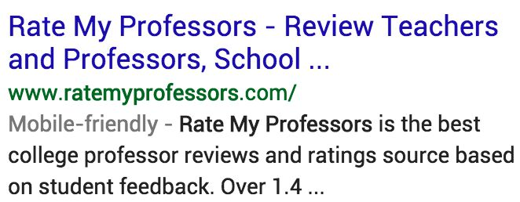
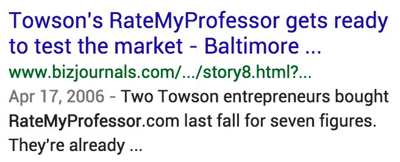

# Non-Fully Meets Results for URL Queries

Raters sometimes ask the question, "For a well-formed working URL query, are the only acceptable Needs Met ratings for a result either **Fully Meets** or **Fails to Meet** ?" The answer is no. There can be other helpful results for URL queries.

Some users issue URL queries to find information about a website, such as reviews or recent news. We recommended this to you as one method of reputation research in the PQ guidelines. Real users do this too. Results that give reviews and reputation information can be very helpful for a URL query.

However, websites that offer usage statistics about a website are not usually helpful results for URL queries. Most users aren't interested in this kind of information.

Query and User Intent|Result Block and LP, Needs Met Rating, E-A-T Rating|Explanation
---|---|---
**Query:** [potterybarn.com]  **User Location:** Palo Alto, California  **User Intent:** Pottery Barn is a home furnishing store. Users may want to go to the website, do research, or find more information on the company.| |This LP is the target of the query.
*(Same as above.)*| |Online coupon codes are very popular in the U.S. and this LP (from a well-known coupon site) displays codes for online purchases on the Pottery Barn website. Users may be interested in coupon codes and this would be very helpful for those shopping online at potterybarn.com, especially frequent shoppers.
*(Same as above.)*| |This LP (from a well-known review site) has reviews of the potterybarn.com website. Users may be interested in reading reviews when considering whether to make purchases at potterybarn.com, especially new shoppers.
**Query:** [ratemyprofessors.com]  **User Location:** Los Angeles, California  **User Intent:** Go to [www.ratemyprofessors.com](http://www.ratemyprofessors.com/), a website where students can rate their college professors.| |This LP is the target of the query.
*(Same as above.)*| |This LP is a Huffington Post article dated August 31, 2012 about ratemyprofessors.com. The article was newly published when it was added to the guidelines. Some users might be interested in this article.
*(Same as above.)*| |This LP is an article dated April 17, 2006 about the ratemyprofessors.com website. Few or no users would be interested in this outdated information.
