# Understanding Mobile Users, Mobile Queries, and Mobile Results

What do you do on your mobile smartphone?

People rely on their phones for many different tasks in different environments. Users may want to search the web or may want to tell the phone to do something specific. Keep in mind that tasks can be simple or complex, and may take multiple steps to complete. For example, a simple task may be to find the director of a movie. A complex task may be to find a movie's showtimes nearby, purchase tickets, get directions, and then use the phone's navigation to go to the theater.

We expect our phones to do a lot. At the same time, phones can be challenging to use, especially compared to a desktop computer or laptop:

- **Entering data may be cumbersome:** typing is difficult on mobile smartphones, and when users speak to their phones instead of typing, voice recognition may not always be accurate.
- **Small screen sizes** make it difficult to use some phone features, apps, and webpages.
- **Some webpages are difficult to use on a mobile phone**. Website navigation can be difficult as menus and navigation links may be small. Webpages may require left-to-right scrolling to read text. Images may not fit on the screen. In addition, many mobile devices cannot access webpages with Flash or other similar features.
- **Internet connectivity can be slow and inconsistent** for mobile users going in and out of networks. App opening, recognition of voice commands, and webpage load times can be very slow on a mobile phone.

**Important: Mobile smartphones should make tasks easy, even for mobile users with a small screen device (i.e., size of smartphone, not a tablet).** Users want results right away, at that moment, and may not be able to spend a lot of time to find what they are looking for.

In order to do mobile rating tasks, you must have experience using a mobile smartphone, which we'll also refer to as a mobile phone in these guidelines. If you are not familiar with voice commands, device actions, or phone features, please take some time to experiment on a mobile smartphone. For example, you can try some of these voice commands:

- [iPhone Siri voice commands](https://www.apple.com/ios/siri/)
- [Android voice commands](https://support.google.com/websearch/answer/2940021?hl=en), or say "OK Google" and then "Help" on an Android device

## Important Rating Definitions and Ideas

**Query**
: This refers to the word(s) and/or number(s) that a user types or speaks into a mobile phone. In these guidelines, queries have square brackets around them. If a user says "navigate home," we display: navigate home. If a user types "iphone" in the search box, we display: iphone.  There are many different types of queries because users ask their phones to do many things, from opening an app to calling a friend to searching the web.

**User**
: The user is the person trying to accomplish something by typing or speaking into a mobile phone with a small screen (i.e., size of a smartphone, not a tablet).

**User Intent**
: When a user types or speaks a query, he or she is trying to accomplish something. We refer to this goal as the user intent.

**Locale**
: All queries have a locale, which is the language and location for the task. Locales are represented by a two-letter country code. For a current list of country codes, [click here](https://guidelines.raterhub.com/images/RG1_1.2-1.jpg). We sometimes refer to the locale as the task location.

**User Location**
: This tells us where the user is located, and should be inferred from the map provided.

**Search Engine Results Page (SERP)**
: The page a search engine shows after a user enters a query in the search box. The SERP is made up of **result blocks**.

**Result**
: We will use the word **result** to refer to the result block _and_ the landing page.

  **Result Block**
  : This is an individual "block" that appears on the user's phone in response to the query. The result block may display information in the block itself or contain links, or may do both.

  **Landing Page (LP)**
  : The page you see after you click a link in the result block.

**Device Actions**
: Mobile phones and other devices can respond to voice commands to perform many actions, such as setting an alarm or opening an app. This is a specific type of query that we'll refer to as a **Device Action** query.

  **Device Action query**
  : Specific type of query where users ask their phone to perform an action. These are frequently spoken commands used to complete actions that would normally require interaction with the screen or the device's controls.

  **Device Action result**
  : The phone may respond to a **Device Action** query by performing an action, such as calling a phone number, etc.

## Understanding the Query

Understanding the query is the first step in evaluating the task. Remember, a query is what a user types or speaks into a mobile phone.

Some tasks include a query research link, which you should use if you don't understand the query or user intent. Otherwise, please do web research using Google or an online dictionary or encyclopedia. If you still don't understand the query or user intent, please release the task.

**Important:** If you research the query on Google, please do not rely on the top results on the SERP. A query may have other meanings not represented on Google's search results pages. Do not assign a high rating to a webpage just because it appears at the top of a list of search results on Google.

Think about users in your locale typing or speaking the following queries into their phone.

- **Query:** population of paris, English (US)  
  **Likely User Intent:** Find the current population of Paris, France.
- **Query:** starbucks near me, English (US)  
  **Likely User Intent:** Find the nearest Starbucks location.
- **Query:** weather, English (US)  
  **Likely User Intent:** Find weather information in the user location right now.
- **Query:** call mom, English (US)  
  **Likely User Intent:** Call/dial the number stored for the contact "Mom" on the device.

## Locale and User Location

All queries have a task language and task location (referred to in rating tasks as the "Locale"). The locale is important for understanding the query and user intent. Users in different locations may have different expectations for the same query. Each rating task will show you the User Location information: some tasks have an approximate user location area and some tasks have a very specific user location.

Note: Examples in the following sections will include a User Location in the form of a city and state. Note that in the actual rating tasks, you will need to infer the User Location based on the map that is provided, as discussed in [Understanding the User Location on the Task Page](/appendix-using-the-evaluation-platform/understanding-the-user-location-on-the-task-page).

For many or most queries, the user location does not change our understanding of the query and user intent. Here are some examples: facebook.com, pictures of kittens, distance between the earth and the moon, call mom. If the task does not display a user location, please evaluate it as a query where the location does not matter and use your judgment.

When is the user location important in understanding query interpretation and user intent? Please use both web research and your personal judgment to answer this question. Ask yourself, "Would users in one city or country be looking for something different than users in another city or country?"

## Queries with an Explicit Location

Sometimes users tell search engines exactly what kinds of results they are looking for by adding the desired location in the query, regardless of their user location. We'll call this location inside the query the "explicit location." The explicit location makes queries much easier to understand and interpret.

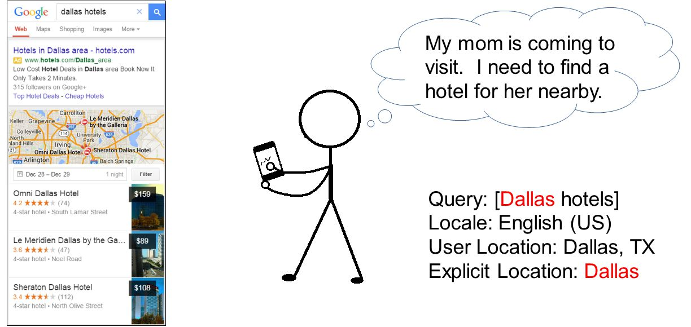
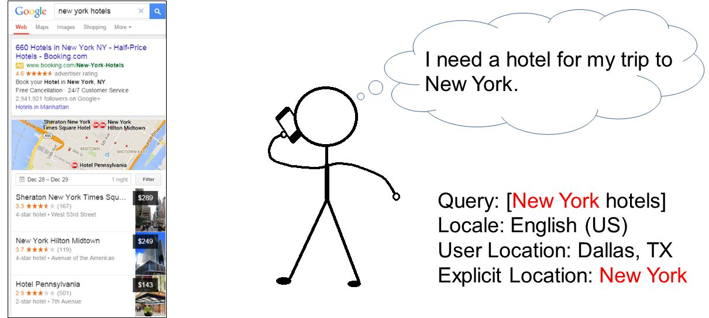

Sometimes the explicit location matches the user location or locale, and sometimes it doesn't.

When there is an explicit location in the query, pay attention to it! Users use explicit locations to indicate exactly what they are looking for.

## Queries with Multiple Meanings

Many queries have more than one meaning. For example, the query apple might refer to the computer brand or the fruit. We will call these possible meanings **query interpretations**.

**Dominant Interpretation**
: The _dominant interpretation_ of a query is what most users mean when they type the query. Not all queries have a dominant interpretation. The dominant interpretation should be clear to you, especially after doing a little web research.

**Common Interpretation**
: A _common interpretation_ of a query is what many or some users mean when they type a query. A query can have multiple common interpretations.

**Minor Interpretations**
: Sometimes you will find less common interpretations. These are interpretations that few users have in mind. We will call these _minor interpretations_.

**Query: apple**\
**Locale: English (US)**
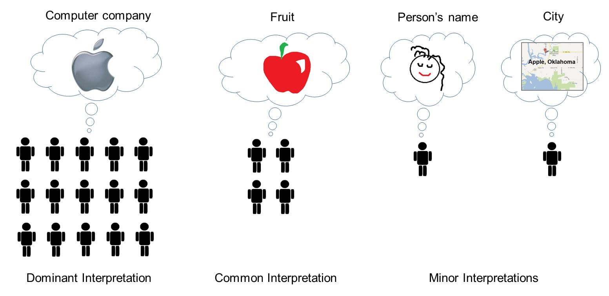

**Query: mercury**\
**Locale: English (US)**
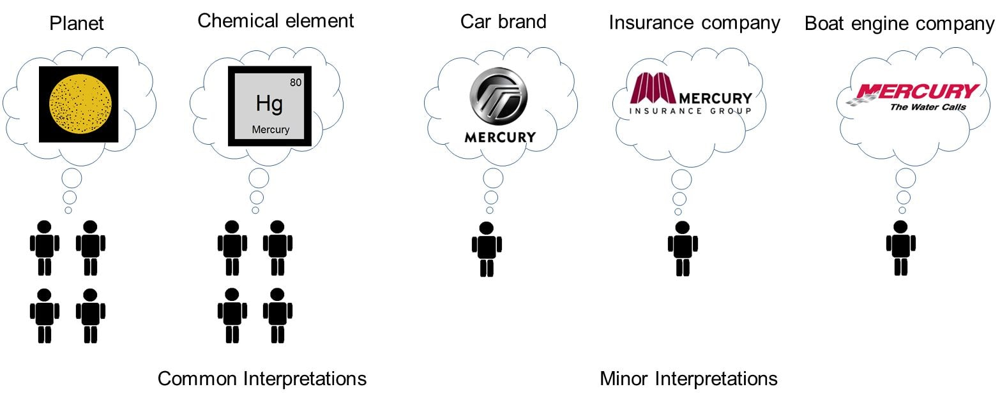

## Query Meanings Can Change Over Time

Remember to think about the query and its current meaning as you are rating. We will assume users are looking for current information about a topic, the most recent product model, the most recent occurrence of a recurring event, etc., unless otherwise specified by the query.

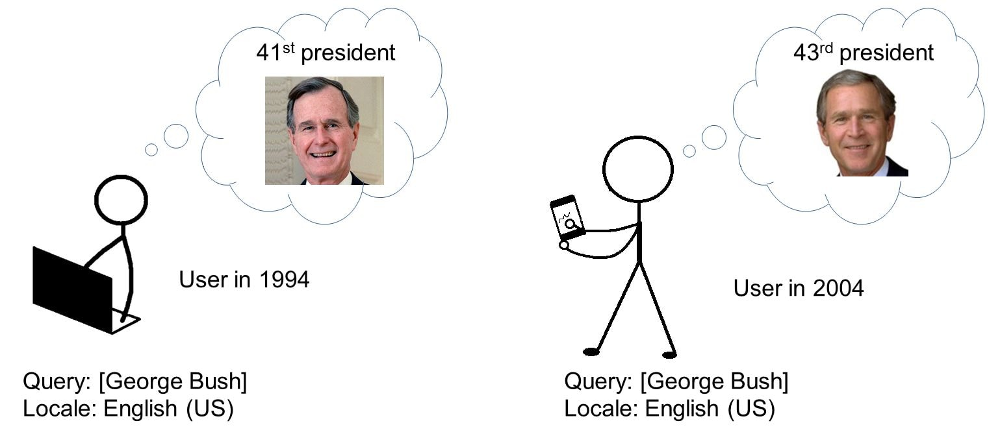
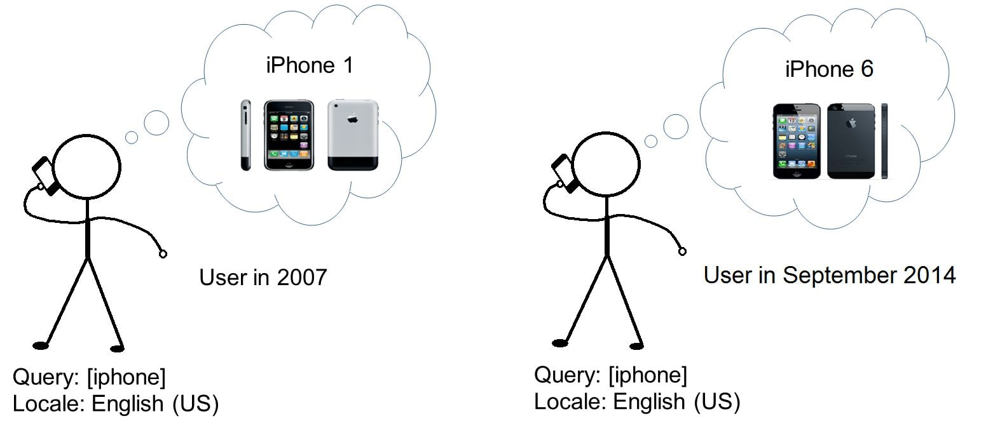

The interpretation of the query iphone, _English (US)_ has changed over time as new iPhone models are released. The first iPhone was introduced in 2007. Users searching for iphone, *English (US)* at that time were looking for the new (at the time) first iPhone model. Most users now are looking for the most recent or upcoming iPhone model. In the future, new models will come out and the dominant interpretation will change again.

## Understanding User Intent

It can be helpful to think of queries as having one or more of the following intents.

- **Know** query, some of which are **Know Simple** queries
- **Do** query, some of which are **Device Action** queries
- **Website** query, when the user is looking for a specific website or webpage
- **Visit-in-person** query, some of which are looking for a specific business or organization, some of which are looking for a category of businesses

### Know and Know Simple Queries

The intent of a **Know** query is to find information on a topic. Users want to **Know** more about something.

**Know Simple** queries are a special type of **Know** query. **Know Simple** queries seek a very specific answer, like a fact, diagram, etc. This answer has to be correct and complete, and can be displayed in a relatively small amount of space: the size of a mobile phone screen. As a rule of thumb, if most people would agree on a correct answer, and it would fit in 1-2 sentences or a short list of items, the query can be called a **Know Simple** query.

**Know Simple** queries may be questions such as how tall is barack obama. Frequently, **Know Simple** queries do not have question words. For example, barack obama height has the same user intent as how tall is barack obama, but is not in a question format.

Most queries are _not_ **Know Simple** queries, such as:

- Broad, complex, and/or in-depth informational queries that do not have a short answer
- Ambiguous or unclear informational queries
- Informational queries on controversial topics
- Informational queries with no definitive "right answer"
- Queries where different users may want different types of information, or different sources of information

Here are some examples where the **Know Simple** query asks for a simple fact, which can be answered correctly and completely in a small amount of space, and the **Know** query answer is more complex.

1. **Know Simple:** barack obama height, how tall is obama
1. **Know:** barack obama

The **Know** query is a broad information query and different users may be looking for different things (e.g., biography, books, social media posts, etc.).

1. **Know Simple:** new york city population 2013
1. **Know:** new york city

The **Know** query is a broad information query and different users may be looking for different things (e.g., tourist and trip planning information, facts, photographs, history).

1. **Know Simple:** who is graves disease named after
1. **Know:** graves disease

The **Know** query is a broad query for medical information and different users may have different needs. There is no single "answer" for this query.

1. **Know Simple:** macy's store hours
1. **Know:** macy's gift wrap options

The **Know** query is a broad query for a particular service offered by a department store, and does not have a short answer.

1. **Know Simple:** what is the symbol for the element nickel
1. **Know:** what nickel is used for

The **Know** query is a broad query and there is no short, complete answer.

1. **Know Simple:** who won the 2014 bcs national championship game
1. **Know:** who is going to win the bcs national championship game

The **Know** query asks for an opinion and there is no definitive answer.

1. **Know Simple:** what is starbucks stock price
1. **Know:** should i invest in starbucks stock

Even though the **Know** query is theoretically a yes/no question, there is not a single answer that everyone would agree on.

Raters must think about mobile users when deciding if queries are **Know Simple**. Use your judgment here.

**Important Rating Example**: The query weather may seem like a broad information query, but most mobile users likely have a fairly simple informational need: to find the current or upcoming temperature, and the chance of local weather events, such as rain or snow. Therefore, we will consider queries like weather, weather today, weather tomorrow, weather this week to be **Know Simple** queries for mobile phone users.

### Do and Device Action Queries

The intent of a **Do** query is to accomplish a goal or engage in an activity on a phone. The goal or activity may be to download, to buy, to obtain, to be entertained by, or to interact with a website or app. Users want to **Do** something.

Here are some examples.

**Query:** get candy crush game  
**Likely User Intent:** Install the Candy Crush game.

**Query:** online personality test  
**Likely User Intent:** Take an online personality test.

**Query:** what is my bmi?  
**Likely User Intent:** Calculate BMI (body mass index).

**Query:** buy citizen kane dvd  
**Likely User Intent:** Purchase this DVD.

**Device Action** queries are a special kind of **Do** query. Users are asking their phone to do something for them. Users giving **Device Action** queries may be using phones in the hands-free mode, for example, while in a car. It's very important for mobile phones to accommodate **Device Action** queries, and we have a high standard for rating these results.

A **Device Action** query usually has a clear action word and intent. The verb or action word is often at the beginning of the query, but a query might start with "OK Google" or "Google" or "Siri" or "I want to." Use your judgment.

Here are some examples of **Device Action** queries.

**Action:** Call someone  
**Examples:** **call** mom's mobile phone, place a **call** to anne jones, ok google, could you please **call** my mom

**Action:** Send a message  
**Examples:** **send** a text to john smith, **text** john smith, **sms** john smith

**Action:** Get map information (e.g., directions, traffic, etc.)  
**Examples:** **navigate** to central park, **show** me traffic, **show** me a map

**Action:** Open an app or webpage, or install an app  
**Examples:** **go** to amazon.com, **open** facebook app, **open** facebook.com, **open** the business section of the new york times, siri, would you **open** facebook for me, **get** candy crush app

**Action:** Play or view media  
**Examples:** **play** me songs from the white album, **watch** the life of pi, **show** me cute kittens, i want to **look** at cute kittens, i want to **listen** to imagine dragons radioactive

**Action:** Schedule a meeting  
**Examples:** **schedule** a meeting for 9am

**Action:** Set an alarm or timer  
**Examples:** **set** an alarm for 6am, alarm for 6am, countdown timer for 30 secs

Here are some examples of queries that are **not Device Action** queries.

**Query:** phone number empire state building  
**Explanation:** There is no action word. The user may be looking for the phone number without the intention of calling the number. We'll consider this a **Know Simple** query.

**Query:** facebook.com  
**Explanation:** There is no action word, such as "open." We will consider this a **Website** query.

**Query:** amazon.com  
**Explanation:** There is no action word, such as "open." We will consider this a **Website** query.

**Query:** anne jones  
**Explanation:** There is no action word, such as "call" or "text." We will consider this a **Know** query for information.

### Website Queries

The intent of a **Website** query is to locate a specific website or webpage that users have requested. This single webpage is called the **target** of the query.

One type of **Website** query is a URL Query, which can be:

- Exact, perfectly-formed, working URLs, such as http://www.ibm.com or www.ibm.com or ibm.com.
- Imperfect URL queries: Queries that look like URL queries, but are not "working URLs". These URLs do not load if you type or paste them into your browser address bar. Even so, we believe users have a specific page in mind.

Here are some examples.

**Query:** kayak, English (US)  
**Likely User Intent:** View the Kayak website.

**Query:** youtube, English (US)  
**Likely User Intent:** View the YouTube website.

**Query:** ebay, Italian (IT)  
**Likely User Intent:** View the Italian eBay website.

**Query:** new york time health section, English (US)  
**Likely User Intent:** View the Health section of the New York Times website.

**Query:** canon.com eos digital camera, English (US)  
**Likely User Intent:** View the EOS digital cameras page on the Canon website.

### Visit-in-Person Queries and User Location

Users carry mobile phones with them throughout the day, for example, at work, to school, to restaurants, or running errands. One reason to carry a mobile phone is to have help with **Visit-in-Person** queries, such as finding coffee shops, gas stations, ATMs, restaurants, etc. Because mobile phones are often used for **Visit-in-Person** queries, make sure to consider visit-in-person intent as a possibility for mobile phone users.

Some queries clearly "ask" for nearby information or nearby results (e.g., businesses, organizations, other nearby places). Some queries are not asking for nearby information or nearby results. Here are some examples.

**Queries with Visit-in-Person Intent**

  
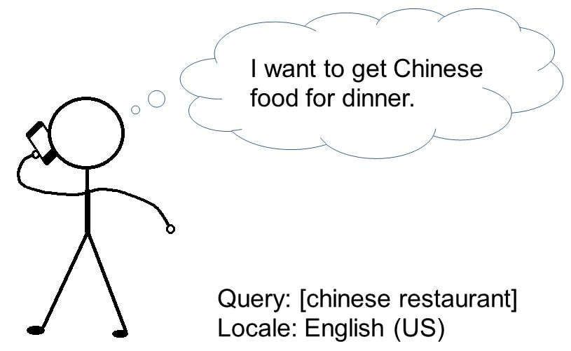

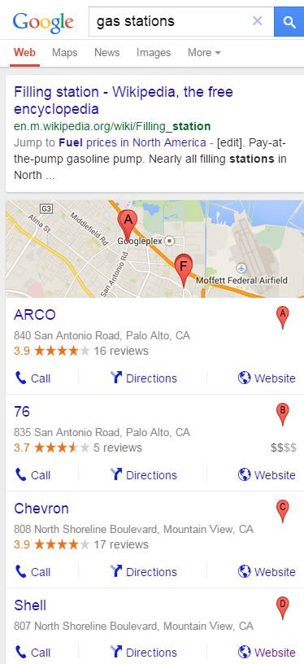  
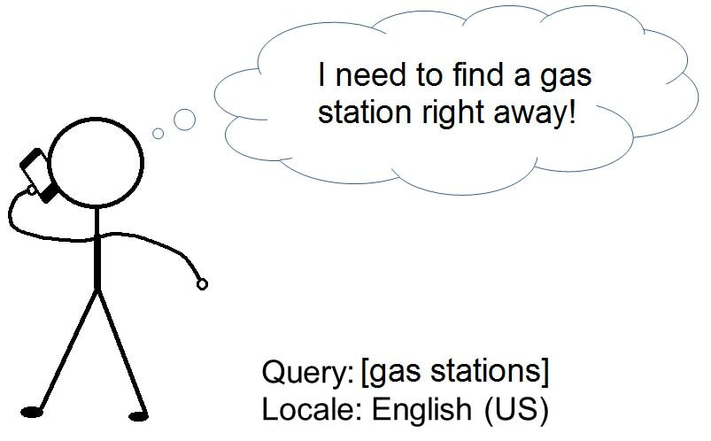

**More examples:** pizza, yoga class, coffee shops, movie showtimes, car repair, dentists, bank of america atm locations, starbucks near me

**Queries with Non-Visit-in-Person Intent**

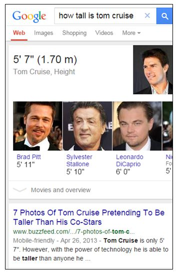  
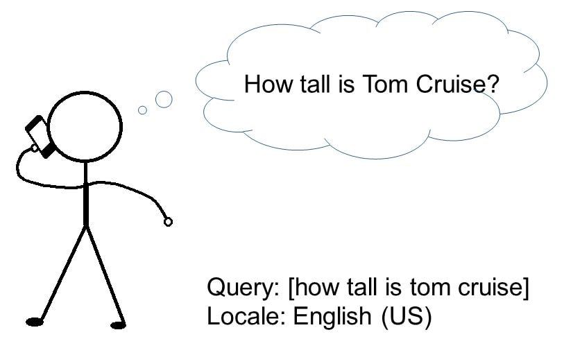

  
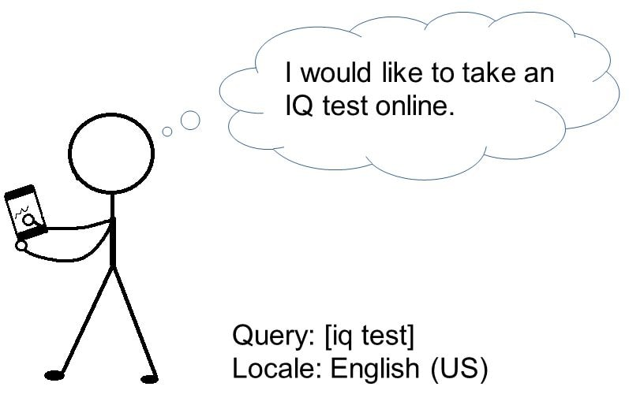

**More examples:** boston red sox, washington post, scrabble cheat, definition of sedentary, aapl, beyonce, angry birds, small dog breeds, dance videos, oscars 2012, pick up lines, bank of america login

And some queries could go either way. Some users may want nearby results and others may not.

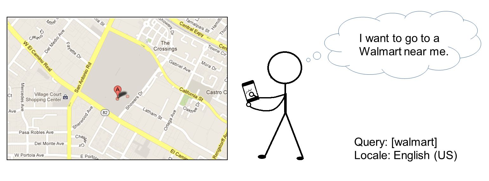\
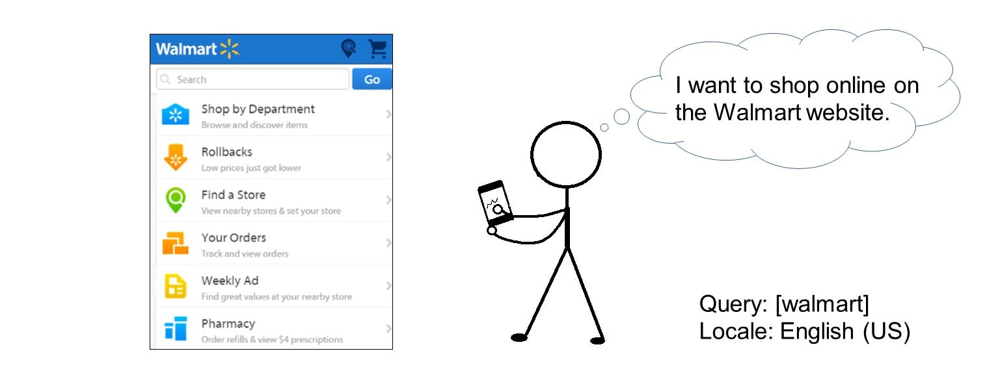

Here are some examples of queries with both visit-in-person and non-visit-in-person intent:

- [hotels](https://www.google.com/search?q=hotels)
- [post office](https://www.google.com/search?q=post+office)
- [apple store](https://www.google.com/search?q=apple+store)
- [citibank](https://www.google.com/search?q=citibank)
- [best buy](https://www.google.com/search?q=best+buy)
- [office depot](https://www.google.com/search?q=office+depot)
- [target](https://www.google.com/search?q=target)
- [library](https://www.google.com/search?q=library)
- [bank of america](https://www.google.com/search?q=bank+of+america)
- [the gap](https://www.google.com/search?q=the+gap)

Sometimes, the user location can change our understanding of the query. For users close to Sunnyvale, California, the query turmeric could have two different interpretations: a popular restaurant named Turmeric or the spice turmeric.

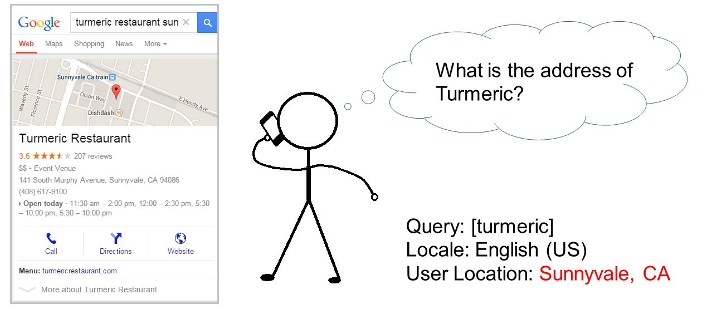\
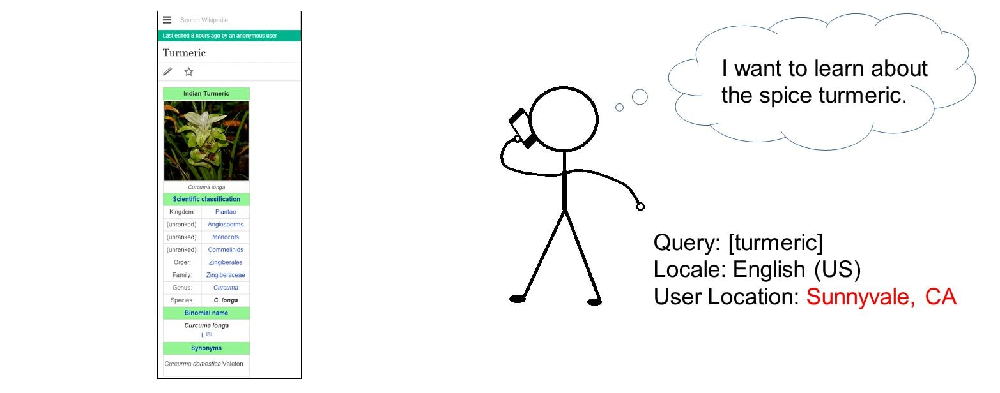

In most other user locations, there is no restaurant (or anything else) named Turmeric and there is just one interpretation of the query turmeric: the spice. The Sunnyvale restaurant is not well-known outside of Sunnyvale, California.

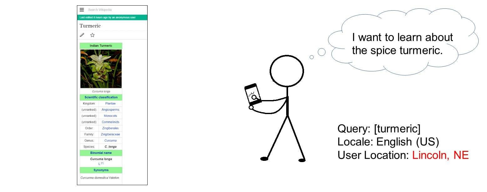

Use your common sense when thinking about queries and whether they have possible visit-in-person intent.

### Queries with Multiple User Intents

Many queries have more than one likely user intent. Please use your judgment when trying to decide if one intent is more likely than another intent.

**Query:** harvard  
**Likely User Intent:** Depending on the user need and location, users may want to visit the official homepage (**Website**), get directions (**Visit-in-Person**), or learn more about the school (**Know**).

**Query:** walmart  
**Likely User Intent:** Most users want to go to a nearby Walmart (**Visit-in-Person**) or view the homepage to shop online (**Website**). Some or few users may want to learn more information about the company (**Know**).

## Understanding Result Blocks

The following sections contain examples of different types of queries and results. In these guidelines, please assume that the result blocks and pages are easy to use on the phone, unless otherwise noted.

### Web Search Result Block Examples

Web Search Result Blocks typically have a title link, a URL and a "snippet" of text describing the page. For many queries, Web Search Result Blocks are the most helpful type of result.

**Query:** cuisinart food processor reviews  
**User Location:** Oklahoma City, Oklahoma  
**User Intent:** This is a **Know** query. The user wants to find recent reviews of Cuisinart food processors.  
**Result:** This is a Web Search Result Block that has a link to a landing page with Cuisinart reviews.

**Query:** broadway tickets  
**User Location:** New York City, New York  
**User Intent:** This is a **Know** query or **Do** query. The user wants to search prices and/or purchase tickets to a Broadway show in New York City.

### Special Content Result Block Examples

Special Content Result Blocks (SCRBs) appear in the search results page, along with Web Search Result Blocks. They are frequently, but not always, the first result on the search results page.

Special Content Result Blocks are designed to show content directly to users on the search results page. From working calculators to playable videos to interactive weather information, these results help users immediately get information or content, and may not require additional "clicks" or page loads.

Because mobile phones can be difficult to use, SCRBs can help mobile phone users accomplish their tasks very quickly, especially for certain **Know Simple**, **Visit-in-Person**, and **Do** queries.

**Important:** Please assume that any interactive features work and function properly. Some notes:

- All result blocks are "screenshots" or images of search results with prominent links enabled. Unfortunately, a screenshot or image of an interactive result block will not function as it would for a real user. **For the purpose of rating, please assume that interactive result blocks do function as intended.** Try to interact with the result block as some links, buttons, or other features may work.
- There may be a delay between when the rating task is created and when you actually rate the block, causing some information in special content result blocks to be a few hours or even days out of date. Stock price or weather informational blocks are designed to give users extremely current and timely information. However, due to a delay in rating time, the information may no longer be accurate.Don't penalize a special content result block for being out of date. **Assume that the blocks show current information for users, unless instructed otherwise.**

**Query:** weather  
**User Location:** Chicago, Illinois  
**User Intent:** This is a **Know Simple** query since mobile users have a fairly simple informational need: find the current temperature and chance of rain or snow. The user wants to know the weather for the User Location.  
**Note:** Assume the block shows current information for users.

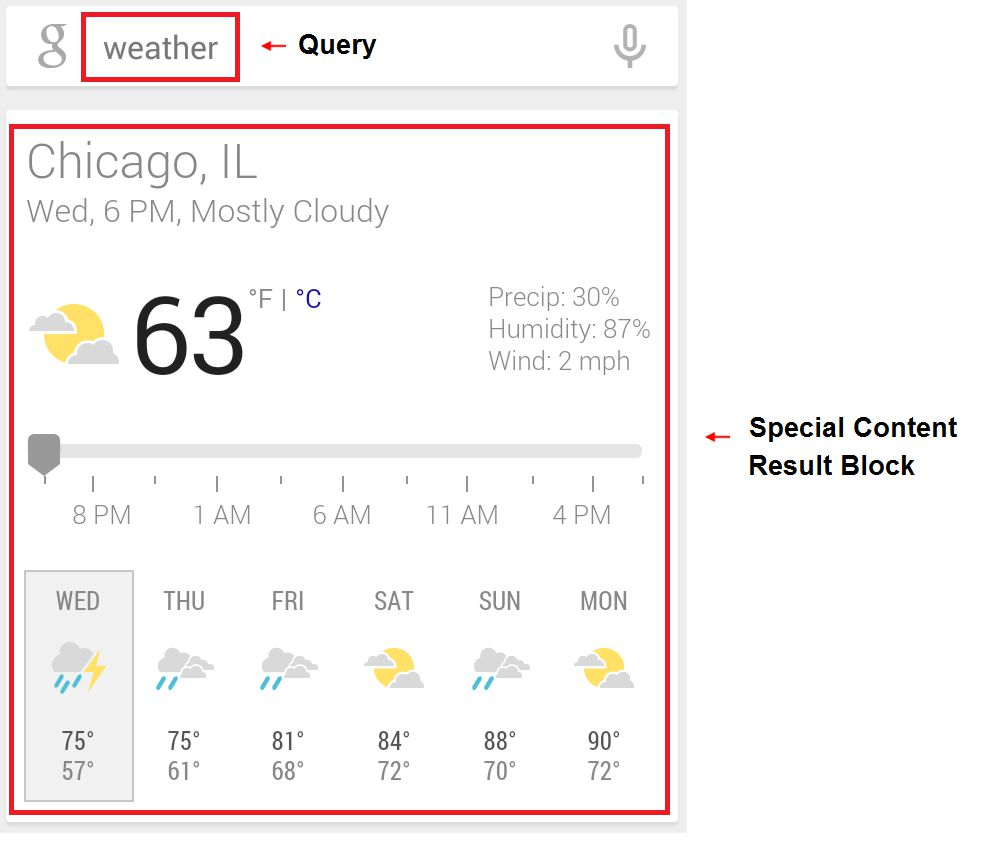

**Query:** emma stone movies  
**User Location:** Des Moines, Iowa  
**User Intent:** This is a **Know** query. The user wants to get information on movies with Emma Stone.  
**Result:** In this result block, users can immediately see some popular movies starring Emma Stone, with an option to click on the links to learn more about each movie. Users can also swipe to see a list of more movies.

**Query:** calories in a banana  
**User Location:** Oakland, California  
**User Intent:** This is a **Know Simple** query. The user wants to find out how many calories are in a banana.

**Query:** baseball scores  
**User Location:** Wichita, Kansas  
**User Intent:** This is a **Know** query. The user wants to find the most recent Major League Baseball scores.

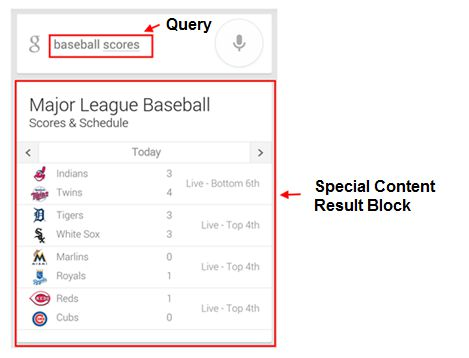

**Query:** coldplay fix you video  
**User Location:** New Orleans, Louisiana  
**User Intent:** This is a **Do** query. The user wants to watch the music video for the song "Fix You" by Coldplay.  
**Result:** By clicking on this result block, users can play the music video for the song on their phone, learn more about the artist/album, etc.

**Query:** what is the tallest tree  
**User Location:** Boise, Idaho  
**User Intent:** This is a **Know Simple** query. The user wants to know what type of tree is the tallest.

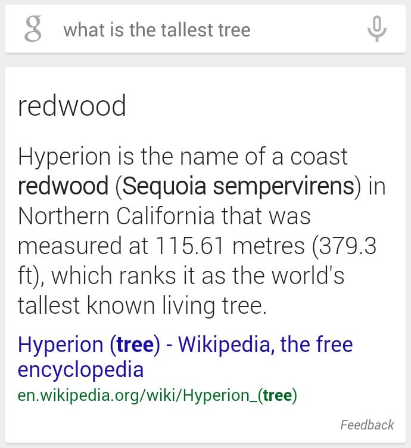

### Device Action Result Block Examples

A mobile phone should respond to a **Device Action** query and do what the user is asking. If the block is a **Device Action** query to open an app, please assume that the user has the app installed on their phone. If the query is to download the app, please assume that the user does not have the app installed on their phone.

**Query:** open angry birds  
**User Location:** Little Rock, Arkansas  
**User Intent:** This is a **Device Action** query. The user wants the device to open the Angry Birds app so he/she can play the game.  
**Result:** In this result block, users can click the link to open the app.

**Query:** go to amazon.com  
**User Location:** Glendale California  
**User Intent:** This is a **Device Action** query. The user wants to go to amazon.com to interact with the website.  
**Result:** In this result block, users can click the links to go directly to the website.

**Query:** set alarm for 5 o'clock am  
**User Location:** Tacoma, Washington  
**User Intent:** This is a **Device Action** query. The user wants to set the device's alarm to go off at 5:00 AM.  
**Result:** In this result block, the query has initiated the alarm on the phone to be set for 5:00 AM.

**Query:** send text to mom  
**User Location:** Tacoma, Washington  
**User Intent:** This is a **Device Action** query. The user wants to send a text message to a contact nicknamed "Mom."  
**Result:** In this Device Action Result Block, the query has initiated a text to the contact nicknamed "Mom," with an option to text either the work or mobile number.

**Query:** call best buy  
**User Location:** Mountain View, California  
**User Intent:** This is a **Device Action** query. The user wants to call the nearest Best Buy store.  
**Result:** In this Device Action Result Block, the query has initiated a call to the nearest Best Buy location.

### How Device Action Results are Displayed in Rating Tasks

**Important note:** Users issuing queries actually experience the phone's response to the query, while raters are given a description of it. If an iPhone user says "Siri, call Mom," the iPhone displays a visual prompt to show that it's dialing a phone number. In these rating tasks, you will see a description of this action.

Please also assume that the phone successfully performs the action in a fully satisfying way.

Below are some additional examples of **Device Action** queries, along with the corresponding "action text" displayed in the rating task.

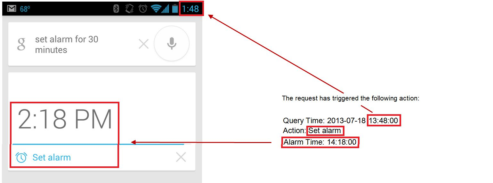

The left side shows what the user sees on the phone for the query set alarm for 30 mins, while the right side shows the "action text" that you (the rater) might see in the rating task.

The text on the right indicates that the user issued the query at 1:48 PM (13:48:00), and the device has set its alarm to go off 30 minutes later at 2:18 PM (14:18:00).

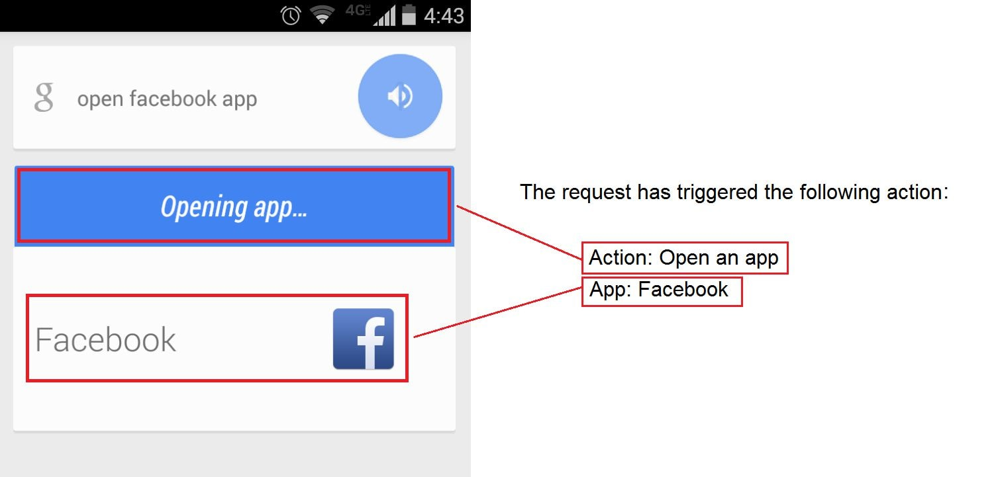

The left side shows what the user sees on the phone for the query open facebook app. In this case, the phone shows an "Opening app" message and then opens the app.

The right side shows the "action text" that you (the rater) might see in the rating task. The text indicates that the device responded by opening the Facebook app on the user's phone.

The left side shows what the user sees on the phone for the query call dan, while the right side shows the "action text" that you (the rater) might see in the rating task.

The user wants to dial the number stored for the contact "Dan" on the device. This text indicates that the device responded by displaying the contact's phone number and dialing the number.

For some **Device Action** queries, the device displays a list of options to choose from before it can respond to the **Device Action** query. Here is an example for the query call target. The user is shown a list of Target stores in the area to choose from.

This example shows that the Device Action result taken by the device will be to call the desired Target store after the user makes his/her selection.

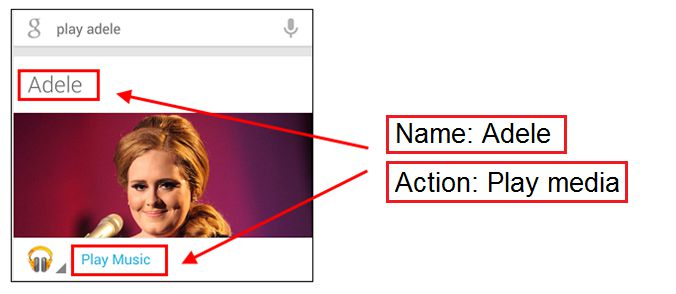

Here is an example for the query play adele. The user is shown a "Play media" type of result. In this case, since the user wants to play music, the Device Action result shown is a "Play Music" button to click.

Clicking this button will play the specified song if the user has the song on his/her device. If not, clicking the result box will give the user options to hear the specified song online.

## Rating on Your Phone Issues

We understand that raters using different phones, operating systems, and browsers may have different experiences. In general, do what you would do naturally, and rate based on your experience. Here are some additional points to keep in mind when you are rating on your phone:

- If you see one of these messages when you open a landing page on your phone:
  - Asks whether you want to open the page in the browser or the website's app: select and evaluate the webpage. However, if the result automatically opens an app by default based on your phone's setting (e.g. some users have set all YouTube pages to automatically open the result in the YouTube app), you should rate your natural app experience—you do not have to change your phone's default settings.
  - Asks whether you want to visit the mobile page or desktop page: it is fine to select the mobile page as long as the landing page is the same. Sometimes, the mobile option will bring you to the mobile homepage instead of the specific URL in the task. You may need to check that the mobile page is in fact the same URL as the desktop page.
- Please open and look at PDF files. Your experience may be easier or harder than other users depending on your phone and browser, but you should still open the PDF file and look at it.
- Occasionally, you may be assigned some of these rating tasks on a desktop computer, but please rate from the perspective of a mobile user unless otherwise instructed.
- You should assume queries were issued on a smartphone. For some queries, there are results that are helpful for specific types of phones—for example, some apps will only work on an Android or iPhone. Please assume that queries with device-specific results were issued on an Android device, unless explicitly stated otherwise in the instructions.
